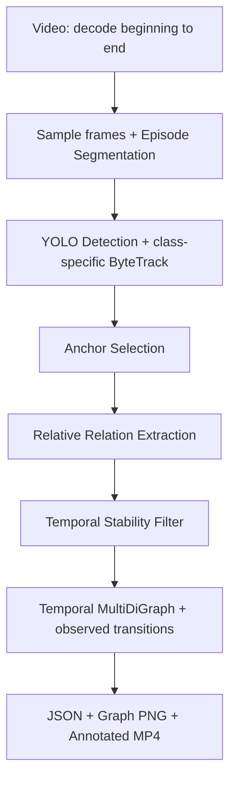

# Relative Video Memory Graph

An **R4DSG-inspired prototype**, not an exact reproduction of R4DSG. It converts RGB video into persistent tracked identities, heuristic scene anchors, and temporally filtered **2D image-space** relations. No previous FindMind implementation or scoring logic is used.



## Install

Use Python 3.12 and [uv](https://docs.astral.sh/uv/). From this directory:

```powershell
uv sync
uv run python --version
uv run python -c "import torch; print(torch.__version__, torch.cuda.is_available())"
uv run python -c "import cv2; print(cv2.__version__)"
uv run pytest
```

The lock file pins dependencies. PyYAML loads configuration; `lap` and SciPy support ByteTrack assignment; pytest is a development dependency. No Docker or external service is required. First inference downloads the official `yolo11s.pt` weights; internet access is required once. Supply a local checkpoint in `detector.model` for offline runs. Ultralytics and its weights have their own license terms; consult [Ultralytics licensing](https://www.ultralytics.com/license) before redistribution.

Defaults are YOLO11s, 960px inference and 5 sampled frames/second. These were selected after inspecting the supplied videos: the nano checkpoint missed several visible objects/anchors. The anchor classes include stationary appliances such as microwave and oven. Temporal support thresholds were not relaxed to create more edges.

`device: auto` selects CUDA when `torch.cuda.is_available()` is true, otherwise CPU. A CUDA-capable GPU also requires a compatible driver and CUDA-enabled PyTorch build; see the [official PyTorch installation selector](https://pytorch.org/get-started/locally/). The default dependency installation does not promise a CUDA build on every platform.

## Run

Place your actual videos in the project root. These videos are user inputs, not generated fixtures.

```powershell
uv run python scripts/run_video.py task1.mp4
uv run python scripts/run_video.py task2.mp4
uv run python scripts/run_all.py
uv run python scripts/inspect_graph.py outputs/task1/memory_graph.json
uv run python scripts/inspect_graph.py outputs/task2/memory_graph.json
```

Optional flags: `--config configs/default.yaml`, `--output outputs/custom`, and `--no-annotated` on `run_video.py`. `run_all.py` accepts `--config` and `--no-annotated`, processes the two root inputs sequentially with fresh trackers, and returns a nonzero exit code if either fails. Existing artifacts in a selected output directory are replaced; input videos are never edited.

## Outputs

Each successful run saves the following under `outputs/<video-stem>/`:

| File | Meaning |
| --- | --- |
| `video_metadata.json` | Source FPS, dimensions, frame count, duration, sampled frame indices/timestamps and complete decode evidence |
| `episodes.json` | Consecutive temporal segments; no activity labels |
| `detections.json` | Raw YOLO detections, including detections not assigned a track |
| `tracks.json` | Class-prefixed graph IDs with all assigned observations and tracker IDs |
| `anchors.json` | Anchor decisions, component measurements, scores and rejection explanations |
| `relation_observations.json` | Co-visible object/anchor relation evidence, normalized geometry and reference type |
| `stable_relations.json` | Episode-scoped intervals that meet support, confidence, duration and gap criteria |
| `transitions.json` | Conservative changes between stable anchor associations |
| `memory_graph.json` | Validated graph nodes, temporal edges, transitions, episodes and run metadata |
| `memory_graph.png` | Anchor-centered graph panels with object/anchor colors and temporal edge labels; repeated IDs are the same node |
| `memory_graph_page_*.png` | Additional pages for crowded graphs; all edges remain inspectable |
| `annotated.mp4` | Optional silent full-duration video with sampled boxes, IDs, anchors, episode and stable relations |
| `run_config.json` | Resolved configuration used for this run |
| `run.log` | Stage progress and warnings |
| `run_status.json` | Complete/failed status, elapsed time, counts and decoded-frame verification |

The video overlay explicitly states the timestamp of the sampled evidence held between inference frames. Anchor and stable-relation labels are retrospective, using the completed video; they are not online predictions. PNG edge labels aggregate repeated intervals for readability; complete intervals are in JSON and the inspection CLI.

## Modules and behavior

`models.py` defines validated data contracts; `config.py` validates YAML. `video/reader.py` decodes every frame, samples at configurable FPS, and includes the final frame. `video/episode_segmenter.py` compares HSV histograms with minimum duration and cooldown, merging short final segments. Cuts are temporal organization only.

`perception/detector.py` performs inference; `perception/tracker.py` runs a separate ByteTrack association per detector class, preventing cross-class associations. Track IDs are mapped to names such as `cup_01`. Misses leave historical memory intact; expired identities are not magically recovered. Trackers reset at episode boundaries to avoid associating unrelated scenes. `object_classifier.py` applies configured aliases such as `dining table` → `table` and `couch` → `sofa`.

`spatial/anchor_selector.py` combines configurable semantic suitability with minimum observation count, elapsed visibility, box area, detection confidence, and median normalized image-center speed. Its score is an explainable heuristic, not a calibrated probability or a candidate ranking formula. Camera motion can reduce anchor eligibility. No person is an anchor in the default configuration.

`spatial/relation_extractor.py` operates on normalized boxes for co-visible pairs within the configured near distance. It emits `LEFT_OF`, `RIGHT_OF`, `ABOVE`, `BELOW` with `reference_frame: camera`, and `NEAR`, `OVERLAPS`, `ON_OR_ABOVE`, `INSIDE` with `reference_frame: camera_relative`. **All are 2D.** `INSIDE` means projected box containment only. `ON_OR_ABOVE` means horizontally aligned and above/near the anchor's top edge; neither means physical containment or support. Relation confidence combines detector confidence and simple geometric margins; it is not calibrated.

`memory/temporal_filter.py` filters by confidence, deduplicates sampled-frame evidence, groups by subject/predicate/anchor/episode/reference, tolerates short gaps, and requires minimum support and persistence. An interval may contain unobserved gaps up to the configured tolerance. `memory/graph_builder.py` constructs a NetworkX MultiDiGraph. Transitions require an unambiguous anchor association followed by a different unambiguous association, with non-overlapping intervals and a bounded gap. The transition time is the first supporting observation of the new interval, not a proven physical movement time. The default reference-predicate preference is containment, above, then proximity. Ambiguous concurrent anchors are excluded from transition inference.

## Limitations and next development stages

- No depth, camera pose, metric distances, world coordinates, physical contact, or true 3D reasoning.
- YOLO11s's pretrained vocabulary limits detectable classes. Arbitrary configured names do not add detector capabilities: keys, doors, shelves and cabinets may be unavailable. Small objects can be missed, and reflections or unfamiliar items can be misclassified.
- Tracking is local continuity, not object re-identification. Fast camera motion, long occlusion, cuts and exits can split one physical object into several IDs; adjacent identical objects may swap IDs.
- Anchors are selected from image-space stability with semantic priors, not verified world-static geometry.
- Sampling can miss brief events. Episode histograms can miss similar-looking cuts or react to illumination changes.
- Timestamps use frame index divided by source FPS. They assume constant-rate video and are approximate for variable-frame-rate recordings.
- Empty relations or transitions are valid if evidence is insufficient. Inspect detections, tracks and overlays before tuning thresholds; do not manufacture edges.
- In-memory JSON intermediates suit short prototype videos; long recordings need streaming storage.
- No lost-object reasoning, candidate ranking, route planning, LLM reasoning, final answering, Streamlit or UI.

After inspecting V1 overlays, the most useful upgrade is camera-motion-aware tracking and better object ReID, evaluated on manually checked identity continuity. Depth and relative 3D geometry can follow. Future packages `depth/`, `reid/`, `reasoning/`, `retrieval/`, `candidates/`, and `ui/` can consume the typed observations and graph without restructuring existing modules; they are intentionally not implemented.

Implementation references: [Ultralytics tracking](https://docs.ultralytics.com/modes/track/) and [ByteTrack source](https://github.com/ultralytics/ultralytics/blob/main/ultralytics/trackers/byte_tracker.py). These are implementation dependencies, not evidence of a paper reproduction.

## Verified supplied-video results

See [VALIDATION.md](VALIDATION.md) for the completed audit, detector limitations and transition analysis. Both videos ran successfully on CPU; all 19 tests passed.

| Video | Episodes | Track IDs (fragments) | Anchors | Stable intervals | Transitions |
| --- | ---: | ---: | ---: | ---: | ---: |
| task1.mp4 | 1 | 77 | 8 | 29 | 0 |
| task2.mp4 | 1 | 96 | 4 | 31 | 0 |

Recheck the saved artifacts without repeating inference:

```powershell
uv run python scripts/validate_outputs.py
```
