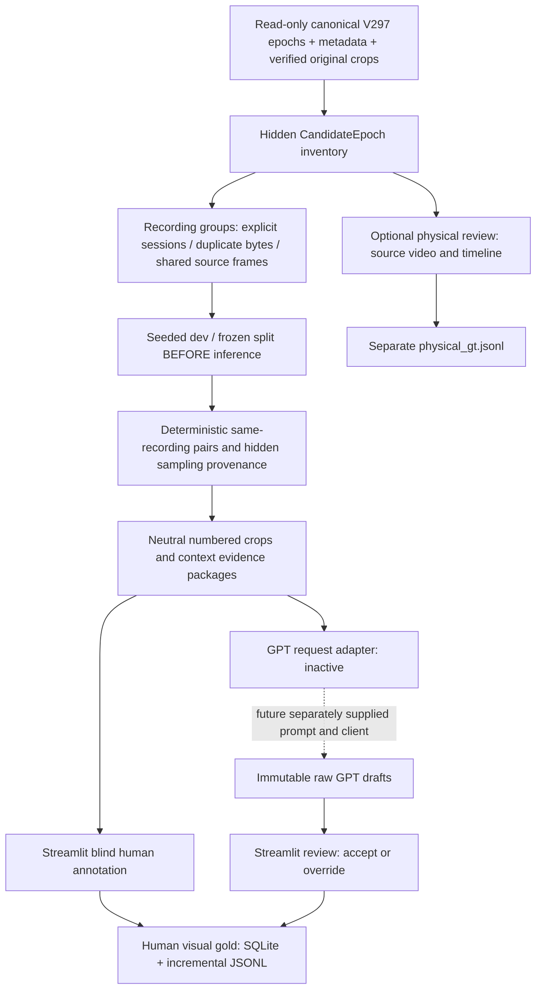

# Pass I Dataset + Annotation Tool

## Result

Implemented and validated offline preparation. **No GPT/model calls, no visual identity annotation, no formal benchmark.**
All new data live in `artifacts/pass_i`; new isolated Python modules and scripts do not modify frozen identity rules.

| Measure | Result |
|---|---:|
| Recording groups | 19 |
| Source videos | 20 |
| CandidateEpochs | 690 |
| Pairs | 2341 |
| Dev groups / pairs | 6 / 720 |
| Frozen groups / pairs | 13 / 1621 |
| CASE_CHANGE_POLICY | UNKNOWN |
| Clean original-resolution crops | 1230 |
| Original context frames | 854 |
| Dataset integrity checks passed / failed | 35141 / 0 |
| pytest passed / failed | 19 / 0 |
| Protected V297/V2101 files unchanged | 4186 |

## Pipeline



## Actual discovered source contract

- Implementation: `src/memory_graph/v296_reid/epochs.py`; V297 imports this CandidateEpochBuilder.
- Canonical outputs only: `outputs/v297_physical_identity/{development,known_val_regression}/runs/<video>/candidate_epochs.json`.
- No diagnostic/older reruns are enumerated into this dataset.
- Serialized container: `epochs`, `events`, `policy`.
- Epoch fields: `candidate_epoch_id`, `start_time`, `start_frame`, `local_track_ids`, `observation_ids`, `end_reason`, `end_time`, `creation_reason`.
- `end_time` in the source is a discontinuity time, not a last-observation time. Inventory `end_frame/end_time` are derived from the final actual observation, with explicit semantics.
- Observation lookup: sibling `metadata.json`, keyed by observation ID. Actual fields include frame/time/bbox/label, local and epoch IDs, verified original crop paths/hashes, source frame pixel SHA, canonical crop dimensions and source-video SHA.
- Read-only identity artifacts: sibling `identity.json`, `authorized_rows.json`, `confirmation_audit.json`, `physical_evidence.json`; these are preserved, not used as visual gold.
- Original clean crops: observation `raw_crop_path`, generally under `outputs/v296_reid/inputs/<video>/raw_crops/`. Existing `crop_path` may be foreground-masked; this builder uses verified original RGB crops instead.
- Existing Core Bank logic: V296 guard checks clean evidence/confidence and trusted diversity, while V297 guard gates bank authority. Pass I does not select only trusted-bank crops or inherit bank decisions.
- V2101 layout: `artifacts/v2.10.1/{freeze,deployment,smoke,reports}`; all protected before/after.
- No explicit cross-video session ID or verified no-case-change protocol was found. Recording-level fallback is used; UNKNOWN is not inferred from phone appearance.

## Session split and leakage controls

Seed: `297101`; dev target fraction: `0.3`. Split is stored and hash frozen before any model output.
20 recordings form 19 groups. **test3 and test5 are unioned into the same frozen group** because original frames are near duplicates.
Exact source pixel hashes are checked over every inventory observation. Near-duplicate full-source-frame audit examined 1010 selected-evidence frames using dHash distance ≤2 plus mean RGB difference ≤8 on 16×16 thumbnails.
These checks reduce observed overlap, but do not prove that different videos belong to different real-world recording sessions. Session overrides are supported for a separately versioned build; this split is never changed in response to model performance.
Known-val regression material was already used by prior development. The frozen Pass I partition is not a claim of new held-out pipeline generalization.

| Video | Split | Epochs | Recording group |
|---|---|---:|---|
| test1 | frozen | 24 | recording_group:1b4f0e9851971998 |
| test2 | frozen | 37 | recording_group:60303ae22b998861 |
| test3 | frozen | 43 | recording_group:03b2a7b72919b4f7 |
| test4 | dev | 32 | recording_group:a4e624d686e03ed2 |
| test5 | frozen | 29 | recording_group:03b2a7b72919b4f7 |
| test6 | frozen | 21 | recording_group:ed0cb90bdfa4f939 |
| test7 | dev | 55 | recording_group:bd7c911264aae15b |
| test8 | dev | 31 | recording_group:1f9bfeb15fee8a10 |
| test9 | frozen | 66 | recording_group:b4451034d3b65900 |
| val_1 | frozen | 31 | recording_group:41e3f57d7635d814 |
| val_10 | frozen | 21 | recording_group:bfe328d4e8640e1b |
| val_11 | frozen | 15 | recording_group:30939347e0bb12a3 |
| val_2 | frozen | 43 | recording_group:129f21905bd414ad |
| val_3 | frozen | 16 | recording_group:87192925353fdd70 |
| val_4 | frozen | 53 | recording_group:4cf2edb609506339 |
| val_5 | dev | 23 | recording_group:eeaa8fef8d80d352 |
| val_6 | dev | 23 | recording_group:bb9ee78e4f3fe97c |
| val_7 | dev | 98 | recording_group:ab82f33b8f261b87 |
| val_8 | frozen | 15 | recording_group:b3e4a91098df5514 |
| val_9 | frozen | 14 | recording_group:89ad29f00ba52aa8 |

## Pair construction and sampling coverage

Pairs are unordered distinct-epoch combinations within each recording, never cross-split. Per recording budget: 120; deterministic hash ordering plus round-robin supported strata. Total selected: 2341.
Shared local ID is only a same-object sampling hypothesis; simultaneous frame presence is only a different-object sampling hypothesis. Generic dHash similarity is a rough near-appearance sampling proxy. None is a label.
The supported categories overlap and their counts must not be summed as distinct items.

| Sampling attribute | Available candidate pairs | Selected pairs | Basis |
|---|---:|---:|---|
| same_object_candidate_pairs | 26 | 26 | metadata/image proxy, never gold |
| different_object_candidate_pairs | 297 | 233 | metadata/image proxy, never gold |
| near_identical_phone_pairs | 447 | 199 | metadata/image proxy, never gold |
| front_vs_back_pairs | 0 | 0 | unsupported without human viewpoint/occlusion inspection |
| large_viewpoint_change_pairs | 0 | 0 | unsupported without human viewpoint/occlusion inspection |
| blur_low_quality_pairs | 1551 | 389 | metadata/image proxy, never gold |
| partially_occluded_pairs | 0 | 0 | unsupported without human viewpoint/occlusion inspection |
| long_gap_pairs | 12506 | 1619 | metadata/image proxy, never gold |
| reappearance_cases | 3 | 3 | metadata/image proxy, never gold |

Viewpoint and partial-occlusion category zeroes mean **no verified source tag is available**, not that such images are absent. Human UI supports these challenge tags later. No visual inspection/identity annotation was performed during preparation.

## Evidence packaging

All 690 epochs have at least one verified phone candidate crop. Crop-count distribution: `{"1": 526, "3": 29, "6": 73, "2": 39, "4": 14, "5": 9}`.
526 epochs have only one selected crop; counts are never padded to 3–6. Selection uses original quality, time spacing (≥0.4 seconds) and nonduplicate visual structure. Viewpoint diversity is a proxy, not a semantic viewpoint label.
Source RGB crops retain original resolution; no enlargement is stored. Contexts are unannotated original frames, encoded as quality-95 JPEG with source pixel hash retained internally.
Neutral filenames and Q/R numbering are shared exactly between UI and adapter. Context IDs cannot be cited as identity evidence.

Hidden inventory/pair manifest retains epoch IDs, chronology, tracker provenance and sampling reason. The public evidence JSON contains only `item_id`, `CASE_CHANGE_POLICY`, and numbered image references. The actual model request contains only policy/item text, numbered labels and image data URIs: no paths, hashes, IDs, scores, aliases, authorization decisions, pair category or GT.

## Annotation tool

Launch from the repository in PowerShell:

```powershell
.\scripts\start_pass_i_annotation.ps1
```

Open `http://127.0.0.1:8511`. Alternative port: `-Port 8512`.
Streamlit 1.50.0 and its dependencies are isolated in `artifacts/pass_i/runtime/vendor`; the existing model environment is unchanged. Version list: `runtime/dependency_versions.json`.

- Blind mode hides GPT drafts; saves separate `human_blind_*` fields.
- Review mode displays validated GPT label/cause/tags/evidence/confidence and supports Accept GPT or Override. Raw response files are immutable.
- SAME / DIFFERENT / AMBIGUOUS / EXCLUDE ITEM controls; mandatory ambiguity/exclusion reason and independent challenge checkboxes.
- Previous/Next/item jump, first-unreviewed resume, split selection, unreviewed/excluded/disagreement filters, previous edits.
- Images show original pixel dimensions; optional close inspection explicitly labels display magnification and provides original download.
- Every save commits to SQLite and exports JSONL/progress. Editing retains annotation history and initial blind judgment.
- Optional physical mode allows original video, timeline and hidden provenance and writes only separate physical GT.
- Excluded items never appear in `AnnotationStore.gold()`.

## GPT adapter

`src/memory_graph/pass_i/adapter.py`: `build_request(public_item, separately_supplied_system_prompt)` builds the actual request without inference. `prelabel(client, ..., enabled=False)` refuses calls by default. The future caller must supply the system prompt, an authorized compatible model client and explicitly enable the pilot.
The configured model name is `gpt-6.1-sol`; availability must be established by the future client. No API credentials are needed for dataset preparation or human annotation.
Malformed GPT responses are preserved separately and cannot be accepted as valid drafts. Human reviewed labels are the only visual-gold source.

## Validation evidence

`reports/dataset_validation.json`, `reports/pytest_results.xml`, `reports/validation_summary.json`.
Tests cover session/frame/hash/numbering consistency, actual serialized request sanitization, disabled-client behavior, ambiguity and tag validation, exclusion from gold, restart/edit persistence, immutable draft/human/physical separation, evidence index validation, crop non-padding, and Streamlit blind save/exclusion/restart/review/physical/filter interactions.
Synthetic GPT responses occur only in test fixtures under `runtime/test_tmp*`; the actual `prelabels/` contains zero responses and actual human annotation files contain zero labels.
Protected snapshot hashes cover 4186 existing V297/V2101 files, all unchanged. No tracker/SAM/DINO/LightGlue/IdentityGuard/Memory Graph rules were modified.

## Artifact locations

- `manifests/candidate_epoch_inventory.jsonl`
- `manifests/session_split.json`
- `manifests/pair_manifest.jsonl`
- `manifests/manifest_hashes.json` and `protected_before.json`
- `items/PI_*/evidence.json`, `items/evidence/<neutral-token>/`
- `prelabels/` (empty until separate pilot)
- `annotations/{annotations.sqlite3,human_annotations.jsonl,physical_gt.jsonl,excluded_items.jsonl,annotation_progress.json}`
- `reports/` (build counts, validation, implementation hashes and this report)

## Next-stage readiness

**Ready for GPT-6.1 Sol pilot: YES for a separately authorized dev pilot.** No implementation blocker remains.
Pilot still requires the separately supplied visual annotation prompt/client. Before a formal benchmark, verify real cross-video session grouping and collect human-reviewed gold; many single-crop epochs may remain visually ambiguous. No accuracy, false-merge or false-split metric is claimed here.
