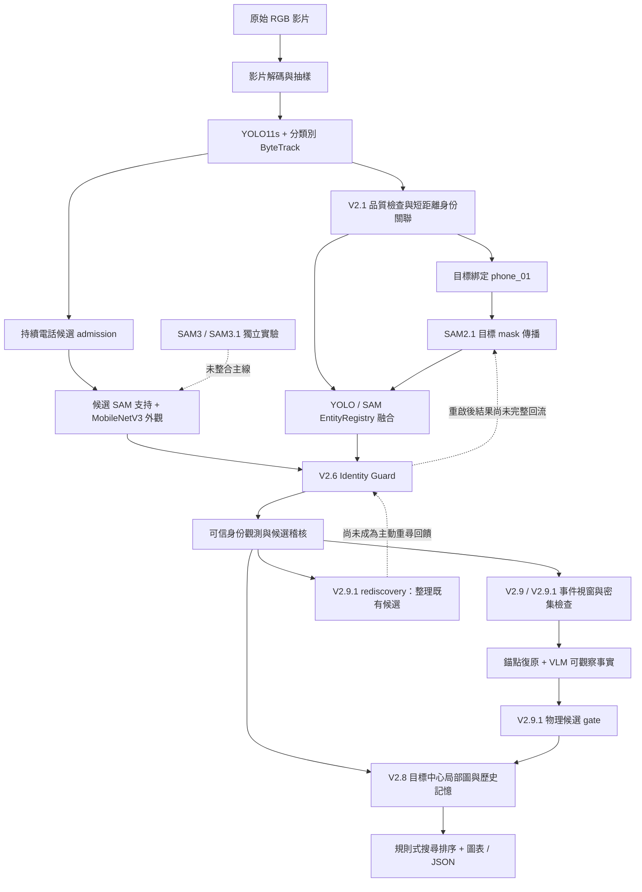

# FindMind 全系統現況、完成度與改善報告

**盤點日期：2026-09-28｜範圍：`mixure_test_SAM`｜最新實作：V2.9.1**

## 1. 整體判斷

FindMind 目前是一個**可以執行、保有實驗證據的離線尋物研究原型**。它已串起影片感知、YOLO／SAM2.1 融合、目標身份、外觀比對、局部空間記憶及搜尋候選輸出；目前還不能視為「能可靠記住物品最後放置位置，遺失後再找回同一物品」的完整產品。

最成熟的是影片讀取、物件偵測、局部追蹤、候選稽核、歷史實驗留存；最需要先修的是**身份狀態傳遞、時間記憶一致性、證據引用、VLM 對準目標、確認後的持續追蹤**。新增候選和圖表的數量已增加，但這不代表尋物成功率已有提升。

### 三層完成度

|衡量層次|目前狀態|判斷依據|
|---|---|---|
|離線實驗基礎|已具備|可處理影片、跑模型、產生 JSON／影像／影片／比較報告；148 個 Python 原始碼檔，29 個測試檔|
|可信的尋物核心流程|部分完成|有身份 gate、記憶及排序；長間隔重尋、重確認後追蹤、放置關係、跨事件記憶仍有缺口|
|可交付給一般使用者的產品|尚未完成|沒有統一最新版影片入口、目標選取 UI、自然語言尋物介面、即時服務與持久化多次工作階段|

**不給單一「完成百分比」**：目前沒有固定產品規格、完整驗收集或可量化的功能分母。用實作狀態及真實驗證程度判斷，比把研究原型寫成某個百分比準確。

### 本次做了什麼

- 盤點主要來源模組、版本腳本、模型設定、歷史報告與 V2.9.1 九支影片輸出。
- 重新執行現有測試：**293 passed、3 failed、1 skipped，22.12 秒**。
- 重新計算 V2.9.1 manifest 的來源、輸出及輸入雜湊：**1,588 個不同路徑全部一致**；另外重查 3 個重複列在歷史 manifest 區段的引用，亦一致。
- 直接比對事件、身份 timeline、registry、dense windows、VLM 輸入、memory 與 search JSON，並檢視代表性 contact sheet。
- 新增本報告、架構圖、可重跑的唯讀稽核程式與測試記錄。模型推論沿用已凍結結果，本次沒有重新跑影片或調整模型。所有新增內容都在本報告資料夾。

## 2. 實際架構

圖例：綠色代表有實際執行證據；橘色代表接通但有重要缺口；灰色代表獨立實驗或未建置。圖中的主線是目前實際資料依賴，不能解讀為所有影片都由同一支最新版程式從頭跑完。

### 目前其實有兩條執行路徑

|資料範圍|實際來源|限制|
|---|---|---|
|test1、test2|V2.9.1 從原影片跑 V2.1 感知、SAM2.1、候選、V2.6 guard，再建立 V2.8 形狀的圖與 V2.9.1 輸出|raw 分支未執行 V2.9 placement detector；mask 授權使用較簡化規則|
|test3–test9|重用 V2.5 rerun／V2.6 身份、V2.8 memory、V2.9 mask／placement 資料，再做 V2.9.1 事件及增補|不是九支影片都用同一最新版流程完整重跑；部分 dense window 重用了不完全涵蓋新事件的舊視窗|

最新版的結果依賴歷史輸出，刪除舊 `outputs_*` 可能讓最新版無法重現。`scripts/run_v291.py` 是固定資料集的實驗入口，還不是通用的 `video + target + output` 執行服務。

### 身份與記憶各自代表什麼

|概念|意義|不能推論成|
|---|---|---|
|YOLO class|看起來像哪種物件，例如 cell phone|這是原來那一支手機|
|ByteTrack ID|一段局部連續追蹤|跨長間隔的永久身份|
|SAM object/local ID|同一段 segmentation session 的 mask 軌跡|PersistentEntity 或跨 session 身份|
|candidate ID|待比對的物件假設|已確認 phone_01|
|PersistentEntity `phone_01`|融合系統想持續維持的同一實體身份|目前每個觀測都必然正確|
|IMAGE_NEAR／IMAGE_OVERLAP|影像平面上的幾何關係|真實空間接近、放在裡面或後面|
|PHYSICAL CANDIDATE|值得進一步查證的物理關係假設|已確認物理事實|
|LAST_TRUSTED|過去最後可信的線索|物品現在必定仍在那裡|

目前已有上述分層設計，但 V2.9.1 的事件／snapshot／時間寫入有偏離，詳見第 6 節。

## 3. 全功能與完成度盤點

狀態定義：**已驗證**＝此專案範圍內有執行或具體測試；**部分完成**＝功能存在但流程、可靠性或真實驗證不足；**實驗分支**＝有結果但未成為主線；**尚未建置**＝未在目前來源找到可用流程。已驗證不代表通用模型 accuracy 已驗證。

### 3.1 輸入、感知與目標追蹤

|功能|已做到|狀態與缺口|
|---|---|---|
|影片讀取|OpenCV 檢查 FPS／影格數，完整解碼，依時間抽樣，記錄 metadata；解碼數量不符會報錯|已驗證；時間用 frame/FPS，沒有 VFR 的精確 PTS 支持|
|影片分段|場景變化及最小時間分段|已驗證的基礎模組；未驗證跨場景的物理位置一致性|
|YOLO 感知|YOLO11s，預設 confidence 0.25、image size 960、5 FPS 感知抽樣|已驗證；小手機、遮擋、箱子／特殊地標的漏檢與錯類仍明顯|
|局部多物件追蹤|分 detector class 的 ByteTrack，track timeline、confidence、motion 與品質資訊|已驗證；短斷軌、class 變動與相似物仍可能產生多個 ID|
|V2.1 PersistentEntity|多線索關聯、共現不能合併、品質 veto；ID 與 track ID 分離|部分完成；整段 tracklet 的離線品質／外觀可用未來觀測，不能聲稱整體是因果即時系統|
|目標綁定|API 接 observation／tracklet／bbox；預設選第一條達成熟條件的手機 track|部分完成；主線寫死 phone-compatible class 及 `phone_01`，尚無使用者選取 UI 或任意類別多目標|
|SAM2.1 連續遮罩|官方 small checkpoint、YOLO box 初始化、mask RLE、bbox／面積／drift 診斷|已接入；SAM-only 連續性不等於身份確認，長 LOST 後不能直接延續身份|
|YOLO＋SAM 融合|EntityRegistry 合併同影格的證據，區分 MATCH／AMBIGUOUS／CONFLICT；raw YOLO 可提供補充支持|已驗證部分情境；純 mask drift 仍可能誤追手／其他物件|
|候選持續 admission|所有後續 cell phone raw detections 可建立／加入候選；保留來源與多視角，處理共現不同物件|已接通；依賴 YOLO 能先看到手機，不是開放類別候選 discovery|
|候選 SAM 支持|為候選 seed 短視窗，保留非空 mask 與診斷；單段最多約 18 個來源影格|部分完成；不是整片候選物的持續追蹤保證|

主要來源：[影片讀取](C:/Users/smile/Desktop/test2/mixure_test_SAM/src/memory_graph/video/reader.py)、[目標綁定](C:/Users/smile/Desktop/test2/mixure_test_SAM/src/memory_graph/v25rerun/binding.py)、[融合路由](C:/Users/smile/Desktop/test2/mixure_test_SAM/src/memory_graph/v25rerun/fusion.py)、[registry／SAM guard](C:/Users/smile/Desktop/test2/mixure_test_SAM/src/memory_graph/v23/fusion.py)。

### 3.2 外觀 Re-ID 與身份安全

|功能|已做到|狀態與缺口|
|---|---|---|
|外觀向量|MobileNetV3 Small ImageNet features＋avgpool，標準化 cosine；mask crop 可去背景|已驗證；是通用影像特徵，非手機專用 Re-ID 模型|
|Trusted appearance bank|只從過去可信 YOLO＋SAM 相符觀測建立；最多 4 prototypes，至少 2 個才足以比對|已接入；視角／尺度／遮擋適應有限，更新後的長期品質未建立基準|
|身份硬約束|語意相容、時間、trusted co-visible 不同物件 veto、候選 SAM 品質|已實作；不能只用 class 或最高 cosine 決定合併|
|V2.6 Identity Guard|相似度至少 0.60、相對第二候選 margin 至少 0.10、winner 要有當前觀測；沒有第二候選只能 PROVISIONAL|已在特定案例驗證；保守規則可能讓只有一個正確候選的情境無法確認|
|不同決策的權限|CONFIRMED 才可 alias、更新可信身份及授權 SAM 重啟；PROVISIONAL／AMBIGUOUS 保留待查|主線 guard 已接通；V2.9.1 下游 reconfirm snapshot 卻有混用 propagated 的問題|
|確認後 SAM reinit|V2.6 在 test8 f804 有執行證據|部分完成；程式明示 `POST_MATCH_CONTINUITY_NOT_FULLY_INTEGRATED`，新遮罩沒有完整回流主身份與記憶|
|多輪 LOST→找回→再 LOST|有多事件標籤、候選稽核|未形成完整閉環；V2.6 每片只設一個 first confirmed 狀態，後續新身份確認與持續更新不足|
|V2.9.1 rediscovery|彙整最後 trusted frame 之後既有候選及 frozen Re-ID 決策|部分完成；没有新的 LOST 觸發偵測／重比對／確認後回饋，`context_consistency` 仍為 None|

主要來源：[外觀模型](C:/Users/smile/Desktop/test2/mixure_test_SAM/src/memory_graph/v24/appearance.py)、[候選比對](C:/Users/smile/Desktop/test2/mixure_test_SAM/src/memory_graph/v25rerun/reid.py)、[V2.6 guard](C:/Users/smile/Desktop/test2/mixure_test_SAM/src/memory_graph/v26/authorization.py)、[V2.6 主流程](C:/Users/smile/Desktop/test2/mixure_test_SAM/src/memory_graph/v26/pipeline.py)、[rediscovery](C:/Users/smile/Desktop/test2/mixure_test_SAM/src/memory_graph/v291/rediscovery.py)。

### 3.3 空間關係、事件與 VLM

|功能|已做到|狀態與缺口|
|---|---|---|
|2D 幾何關係|bbox 接近、方向、重疊、包含；穩定多影格支持|已驗證；沒有深度、相機姿態、世界座標或尺度校正|
|目標中心局部圖|phone_01、primary anchor 與 hop-2 context；V2.8 預設每快照最多 3 個 primary，每個最多 2 個 context|已實作；V2.9.1 追加候選會把更多物件塞回 final local graph，沒有完整沿用原限制|
|Anchor role|CONTAINER、SUPPORT、OCCLUDER、LANDMARK、INTERACTION_AGENT、UNKNOWN 等|已實作標籤映射；寫了 box 角色不表示 detector 已能找出 box|
|Anchor recovery|dense YOLO 與已有 entity 配對；短窗同類別 IoU 群組成 event-local anchor|部分完成；沒有接入 open-vocabulary／VLM box proposal；目前 118 個 local refs 不代表 118 個全域實體|
|放置視窗|V2.9 根據 loss、motion slowdown、approach、overlap 等訊號找視窗|已有執行；V2.9.1 raw test1/2 未接這條支線|
|多事件|LOSS、RECONFIRM、OCCLUSION、SECOND_LOSS、POSSIBLE_PUTDOWN；每片最多 3 個優先事件|部分完成；hard cap 及晚事件優先可能排除真正的最後放置片段，reconfirm 語意也需要修正|
|密集重檢|約 3 秒視窗，YOLO＋SAM2.1 增加時間解析度|已執行；重用 cache 的範圍及 mask 路徑有實際缺陷|
|VLM 基礎設施|本機 Transformers、可選 HTTP backend、JSON parser、cache、事件前中後圖；有 3B／7B 設定|基礎模組已建；不是所有設定／cache 都被最新分支使用|
|V2.9.1 observable VLM|Qwen2.5-VL-3B，8 個 YES/NO/UNCERTAIN 欄位，禁止直接回傳 relation label|實際呼叫 30 次；解析通過但對準目標的證據不足，常敘述籃球／娃娃|
|物理關係 gate|V2.8／V2.9 有 NEAR、ON、INSIDE、BEHIND、OCCLUDED_BY、HELD_BY 的規則及合成測試|部分完成；九片沒有真實 PROMOTED；V2.9.1 新分支本身沒有可到达 PROMOTED 的程式路徑|

主要來源：[V2.8 local graph](C:/Users/smile/Desktop/test2/mixure_test_SAM/src/memory_graph/v28/local_subgraph.py)、[V2.9 physical gate](C:/Users/smile/Desktop/test2/mixure_test_SAM/src/memory_graph/v29/physical_gate.py)、[V2.9.1 anchors](C:/Users/smile/Desktop/test2/mixure_test_SAM/src/memory_graph/v291/anchors.py)、[events](C:/Users/smile/Desktop/test2/mixure_test_SAM/src/memory_graph/v291/events.py)、[VLM](C:/Users/smile/Desktop/test2/mixure_test_SAM/src/memory_graph/v291/observable_vlm.py)。

### 3.4 記憶、搜尋、可視化與工程

|功能|已做到|狀態與缺口|
|---|---|---|
|時間記憶|relation episode、開始／結束時間、ACTIVE／ENDED／STALE／LAST_TRUSTED、重要事件 snapshots|V2.7／2.8 已實作；V2.9.1 新增 episode 的時間與狀態一致性有缺陷|
|Lifetime memory|以目標為中心保留歷史與最後可信子圖，來源可追溯|部分完成；仍是 JSON artifact，尚無跨影片／長期資料庫與統一 replay schema|
|Lost-object search|只在 UNOBSERVED 時輸出；5 階規則，physical placement 優先、再候選／image context，排除 HELD_BY/person 搜尋位置|已接通；候選數不是找回率，最新資料的 0 秒時間及過量候選會影響排序|
|圖與稽核輸出|local／lifetime／search graph、timeline、contact sheet、JSON、文字 search plan|已產出；V2.9.1 lifetime/search 繪圖共用 final local edges，未完整呈現各自內容|
|Annotated 影片|上游偵測／track／事件 overlay MP4|已存在；尚無同步 V2.9.1 身份、SAM mask、圖與搜尋狀態的單一總覽影片|
|Freeze 與 GT 隔離|模型／預測／部分來源 manifest，凍結後才做人工參考評估|已實作；歷史 3 項 hash 測試失敗，最新版未完整封存所有 transitive inputs／程式／設定|
|測試|現有 297 項：293 pass、3 fail、1 skip；包含演算法 fixtures、artifact assertions|有基礎；沒有覆蓋本次查到的跨模組語意缺陷，不能用通過率代表模型正確率|
|統一部署／服務|有個別版本 CLI 和 pyproject／uv 設定|部分完成；缺最新版通用 runner、穩定設定注入、服務 API、CI 發布及整體延遲／資源基準|
|使用者產品層|尚未找到 web/mobile UI、物件選取與更正、自然語言尋物查詢、可互動回放|尚未建置|

主要來源：[V2.8 memory](C:/Users/smile/Desktop/test2/mixure_test_SAM/src/memory_graph/v28/memory.py)、[search planner](C:/Users/smile/Desktop/test2/mixure_test_SAM/src/memory_graph/v28/search_planner.py)、[V2.9.1 runner](C:/Users/smile/Desktop/test2/mixure_test_SAM/scripts/run_v291.py)。

## 4. 已有實驗成果與可相信的範圍

### 4.1 版本演進

|版本|主要成果|今天應如何使用|
|---|---|---|
|V1／V2|離線感知、空間圖、事件／VLM、annotation|基礎能力與歷史比較；README 主要還停在此層|
|V2.1|品質控制、PersistentEntity 與事件上下文分離|仍為上游資料來源；不等於後續融合 registry|
|V2.2|官方 SAM2.1 時間傳播 A/B|提供主線 segmentation 基礎|
|V2.3|YOLO＋SAM 融合、guard、來源中立 entity|短遮擋與同影格關聯已有正例|
|V2.4|MobileNet 外觀記憶與 safe long-gap Re-ID|舊 task2 一個正確長間隔案例；不能替代最新版泛化驗證|
|V2.4.1／V2.5＋rerun|擴至 test3–9、通用手機目標綁定、持續候選、更新影片後重跑|提供目前多數影片上游資料；有歷史 hash 偏差待整理|
|V2.6|防止單一候選誤確認，區分 confirmed／provisional，持續稽核|test7 假正例保持 provisional；test8 f804 有真確認；重啟後持續融合未完成|
|V2.6.1／2.6.2|SAM3.1／SAM3 對比|独立模型實驗；主線仍選 SAM2.1|
|V2.7／2.8|目標時間記憶、局部圖、角色、分層物理推論與規則搜尋|架構已有；真實物理放置仍無 promotion|
|V2.9|可信歷史 mask 接線、放置視窗、dense evidence 與 VLM gate|mask 連結有所改善，關鍵錨點與可信同現仍不足|
|V2.9.1|多事件、event-local anchors、候選重尋稽核、test1/2 raw pipeline 復原|最新輸出已生成；需要先修本次盤點出的資料契約問題|

### 4.2 九支影片現況

下表皆為**既有凍結輸出與本次唯讀稽核**；本次沒有新做全片模型推論。

|影片|基礎抽樣影格|YOLO detections|報告列為可信的 SAM masks|事件數|重尋候選觀測／不同候選 ID*|本次列表中的 Guard 確認|搜尋項目|
|---|---:|---:|---:|---:|---:|---:|---:|
|test1|162|1,125|50|1|40／13|0|18|
|test2|155|1,511|76|3|66／4|0|27|
|test3|196|1,805|45|3|43／16|0|40|
|test4|196|1,677|42|3|24／18|0|39|
|test5|187|1,672|58|3|33／17|0|41|
|test6|167|1,342|36|1|47／20|0|13|
|test7|221|1,791|38|1|195／24|0，另 1 provisional|18|
|test8|185|1,523|39|1|88／23|1，f804|3|
|test9|201|1,764|12|3|93／32|0|0|
|合計|1,670|14,210|396|19|629／167|1|199|

\* 不同候選 ID 只在各影片的 rediscovery 列表內去重；167 是 `(video, candidate_id)` 數量，不能視為 167 支真實手機。396 個 mask 在 raw 與 replay 路徑採用不同授權流程，尚不宜視為統一品質指標。

- 843 個 PersistentEntity registry entries 是跨片假設總和，不是經 GT 證實的 843 個物理物件。
- 118 個 event-local anchors、110 個 existing anchor references 是事件範圍統計；同物件可重複計數。
- 356 個 target-anchor 共視 frame observations 有重疊視窗重複，不能當獨立新增證據。
- 173 個物理候選：128 NEAR、45 OCCLUDED_BY；另 53 UNCERTAIN；**0 PROMOTED**。
- 199 個搜尋項目＝158 個未確認物理候選位置＋41 個影像 context；**不是 199 個可確認位置**。
- VLM 30 次可解析：8 個 categorical facts × 30＝240 欄，另 60 個 summary／uncertainty 字串。舊統計的「300 facts」只是字典欄位數，不是 300 個已驗證事實。

### 4.3 SAM 比較目前可用的結論

保留既有 `KEEP_SAM21` 結論。SAM3.1 的執行障礙不應寫成準確率較差；SAM3 box 的原始長視窗結果是 0／1,113 non-empty。SAM3 point 有輸出，但既有稀疏人工檢查中 drift 較多。

既有 SAM3 smartphone concept 補充實驗只測 test8：150 個不同來源影格、兩個重疊 session 共 200 個 frame observations；76／150 個來源影格有 text mask，10 個 session-local IDs；f804 session 的 ID0 有 f804–966 共 28 個抽樣影格延續，也有其他電話被當成 smartphone。結論為 `CONCEPT_DETECTION_SHOWS_USEFUL_CONTINUITY`，用途是 candidate discovery，未接到 `phone_01`。

既有 paired propagation 計時約 SAM2.1 57.79 秒／SAM3 box 213.49 秒／SAM3 point 226.43 秒；peak reserved VRAM 約 0.805／7.09 GiB。這些是特定實驗的 propagation 階段數據，不是整套系統 FPS 或目前機器負載量。本次不延伸 SAM 實驗。

來源：[V2.6.2 報告](C:/Users/smile/Desktop/test2/mixure_test_SAM/outputs_v262/V262_SAM21_VS_SAM3_REPORT.md)、[SAM3 concept 補充](C:/Users/smile/Desktop/test2/mixure_test_SAM/outputs_v262/supplementary_sam3_concept/SAM3_CONCEPT_TEST.md)。

### 4.4 評估覆蓋還很有限

task1 稀疏人工可見框 10 個，class-agnostic IoU≥0.30 配到 8 個，其中類別正確 6 個；phone 8 個可見樣本配到 6 個。task2 可見框 22 個配到 15 個，其中類別正確 14 個；phone 17 個樣本配到 11 個。部分球／垃圾桶被當成 cup，會污染記憶的語意。

這些是非隨機、少量、選定影格的診斷。尚無完整 object detection mAP、mask IoU、IDF1／HOTA、長間隔同物件找回率、false merge rate、最終放置 Top-k 命中率或 end-to-end success rate。測試通過數與 JSON VALID 都不能替代這些指標。

## 5. 哪些舊敘述需要更正

### 5.1 test2 的短間隔身份其實已接起來

目前 [test2 融合 registry](C:/Users/smile/Desktop/test2/mixure_test_SAM/outputs_v291/test2/entity_registry.json) 的 `track_to_entity`：

|local track|目前融合 entity|
|---|---|
|22|phone_01|
|43|phone_01|
|78、81|entity_0076|
|80|entity_0078|

舊 [test2 evaluation](C:/Users/smile/Desktop/test2/mixure_test_SAM/outputs_v291/test2/evaluation.json) 把上游 V2.1 的 entity_0019／entity_0031 當成目前 fusion ID，因此「22→43 仍未合併」這句不正確。**短間隔接續已完成；V2.6 長間隔 confirmed 為 0 仍然成立。** 左右桌上電話在目前 registry 也維持不同 entity。

同理，test1 目前 target track17→phone_01、desk phone track70→entity_0067；chair tracks58／60→entity_0055／entity_0057。跨不同 registry 層比較 ID 時必須明列來源。

### 5.2 「8 個 RECONFIRM」只有 1 個是 Guard 確認

|影片／影格|原 timeline state|同影格 CONFIRMED_MATCH|V2.9.1 snapshot|
|---|---|---|---|
|test2 f624、f648、f792|VISIBLE_PROPAGATED|無|MATCHED|
|test3 f510|VISIBLE_PROPAGATED|無|MATCHED|
|test5 f462|VISIBLE_PROPAGATED|無|MATCHED|
|test8 f804|UNOBSERVED（未回寫的原 timeline）|有|MATCHED|
|test9 f786、f1038|VISIBLE_PROPAGATED|無|MATCHED|

這裡同時暴露兩件事：V2.9.1 把 propagation 恢復誤標成身份確認；V2.6 的確認也沒有同步回寫到所有狀態資料。test9 因此不能被描述成「已找回兩次」。

### 5.3 「0 promotion」不能只歸因於證據不足

V2.8／V2.9 真實測试沒有 promotion，與證據不足相符。但 V2.9.1 新的 `gate()` 固定回傳 `physical_promotion=False`，decision 只有 CANDIDATE／UNCERTAIN，未呼叫 V2.9 的 promotion gate。**即使提供充分證據，新支線也無法升格。** 應先補接線再評估能力；不能把恆不升格的結果當成已驗證的高精確率。

## 6. 必須先处理的缺口：按重要性排序

P0＝會讓身份／時間／證據失真，應阻止把結果當可信完成版；P1＝阻礙尋物核心能力；P2＝阻礙可重現與可維護；P3＝產品擴展。優先序依目前程式與既有案例，不依模型流行程度。

### P0-1：統一身份狀態與寫入權限

**已確認問題：** `VISIBLE_PROPAGATED` 被列入 reconfirm 的 TRUSTED 集合；`_add_reconfirm_memory()` 為所有 reconfirm 建立 `target_state=MATCHED`，即使附近沒有可信 phone observation。本次凍結輸出有 7 次上述誤標。

**影響：** 圖表、事件、評估會把 segmentation continuity 當成重新識別。雖未發現這七次修改 V2.6 alias，本來為了保護記憶的語意已被削弱。

**最小修正：** 拆開 PROPAGATION_RESUMED、TRUSTED_DETECTION_RESUMED、IDENTITY_CONFIRMED；所有 MATCHED 必須引用精確 frame 的身份授權；snapshot、registry、timeline 使用同一事件來源。原始 V2.6 門檻保持不變。

**驗收：** synthetic 的 UNOBSERVED→VISIBLE_PROPAGATED 不得產生 identity confirmation；現有 test8 f804 可確認；test9 無授權時不能增加 MATCHED。來源：[events.py:5](C:/Users/smile/Desktop/test2/mixure_test_SAM/src/memory_graph/v291/events.py:5)、[pipeline.py:413](C:/Users/smile/Desktop/test2/mixure_test_SAM/src/memory_graph/v291/pipeline.py:413)。

### P0-2：修復記憶時間、stale 狀態與各視圖一致性

**已確認問題：** 新增 173 筆 physical candidate episodes 全部 `start_time=0`、`last_confirmed_time=0`，全部標 LAST_TRUSTED；搜尋有 138／199 筆時間為 0。raw test1/2 的 full temporal store 也未同步新增的 7／29 筆 physical episodes。test3–9 使用的是僅存 snapshots/events 的另一種 temporal schema，不能混稱同一 store。

**影響：** 新舊線索排序、最後可信位置、證據跳轉與 graph replay 可能不一致；上百條未確認候選堆到最後可信子圖，削弱 target-centered 的精簡設計。

**最小修正：** 從同一 event store 產生 lifetime／temporal／search；使用實際支持影格時間，而非整個視窗的 0 秒 placeholder；新確認後把舊 context 正確轉 STALE；限制 final subgraph 的 relevant anchors。

**驗收：** 非 frame0 證據不能顯示 0 秒；每個搜尋列可回查 episode、snapshot、video/frame；完整重播各視圖一致，舊 context 不得冒充最新。來源：[pipeline.py:559](C:/Users/smile/Desktop/test2/mixure_test_SAM/src/memory_graph/v291/pipeline.py:559)、[search_planner.py:7](C:/Users/smile/Desktop/test2/mixure_test_SAM/src/memory_graph/v28/search_planner.py:7)。

### P0-3：修復 dense cache 視窗及 mask provenance

**已確認問題：** 11 個重用 V2.9 的視窗全部缺少本地 `target_masks.json`；其中 7 個沒有完整覆蓋新事件要求的時間範圍。程式只檢查 peak 在旧視窗內；換掉 event_id 後才組舊 mask 檔案路徑，路徑因此指向不存在的 V291 ID。

例：test3 的新 E02 要求 f465–555，實際仍是 f447–537；test5 E03 要求 f435–525，仍使用 f393–483。

**影響：** 新事件看起來已被檢查，實際缺了最後階段；事件、幾何數值與可重建 mask 脫節。這不表示歷史 mask 原件消失，但最新版的引用鏈不完整。

**最小修正／驗收：** cache key 包含 source video hash、模型／程式／設定及完整窗口；保存原 event ID；只有完整覆蓋才重用；mask 引用必須存在、可解碼、對上相同 frame。來源：[pipeline.py:309](C:/Users/smile/Desktop/test2/mixure_test_SAM/src/memory_graph/v291/pipeline.py:309)。

### P0-4：讓 VLM 真正看同一個 target-anchor pair

**已確認問題：** 同事件的不同 anchor 共用完全相同三張圖，圖中所有 anchors 都是 magenta；prompt 卻說「magenta box 就是指定 anchor」。15 組雙 anchor 呼叫均如此。30 次呼叫中 4 次三張圖都沒有畫出獲授權 target box；1 次指定 anchor 也未出現在三張輸入圖。另 24 次只有一張圖有 target box。

**觀察到的結果：** test1 回答籃球的放置／放手；test2 回答 teddy bear 是否移动。VALID 只代表 8 欄值可解析，不代表主詞是 phone_01。代表性 [輸入 contact sheet](C:/Users/smile/Desktop/test2/mixure_test_SAM/outputs_v291/test1/event_visuals/V291E01/contact_sheet.png) 可看到多個 magenta 框，沒有綠色可信 phone 框。

**最小修正：** 以事件中真正有可信 target 的 frame 選 BEFORE；每次只突出 queried anchor 與 target，給 pair crop、清楚 ID、必要的 mask；缺少目標可觀察證據時回報 EVIDENCE_UNAVAILABLE；解析後另查 subject／anchor grounding。

**驗收：** 人工檢查每張 pair input 可指出正確物件；VLM 談到球／娃娃時不能當手機 facts；時間片段缺失會明確拒收。來源：[pipeline.py:500](C:/Users/smile/Desktop/test2/mixure_test_SAM/src/memory_graph/v291/pipeline.py:500)、[observable_vlm.py:21](C:/Users/smile/Desktop/test2/mixure_test_SAM/src/memory_graph/v291/observable_vlm.py:21)。

### P0-5：統一可信 mask 授權，補上跨事件 key

**已確認的程式差異：** raw test1/2 以 fusion MATCH frame 就輸出 trusted mask；test3–9 的 V2.9 授權另查 RLE、drift、同影格狀態與 continuity chain break。兩路的「trusted」不能當同一標準。

**尚未在這批輸出造成不同 label 的潛在缺陷：** `anchor_by_id` 只以 `event_anchor_001` 等局部 ID 存放；不同事件會覆寫同 key，寫入 memory 時才補 event namespace。本批實際 label mismatch＝0，但 provenance 文字過於通用，不能排除取到另一事件同類別實體；當事件同號 anchor 類別不同時會錯綁。

**最小修正／驗收：** 唯一 mask authorization 接口；key 統一為 `(video, event_id, local_id)`，跨所有 candidate／anchor／artifact 引用；兩個事件同 local ID 不同類別的回歸案例必须保持分離。來源：[pipeline.py:286](C:/Users/smile/Desktop/test2/mixure_test_SAM/src/memory_graph/v291/pipeline.py:286)、[pipeline.py:740](C:/Users/smile/Desktop/test2/mixure_test_SAM/src/memory_graph/v291/pipeline.py:740)。

### P1-1：完成 confirmed 之後的持續追蹤及再遺失流程

目前 reinit 有執行，但結果未完整回流；V2.6 `confirmed` 一旦設定後，新的 confirmation 搜尋受限。test8 f804 的確認也仍與 UNOBSERVED 舊 timeline 並存。

**要補：** CONFIRMED→更新 registry／timeline→使用 matched box reinit→每幀再過 guard→更新可信觀測／bank／memory→再次 LOST→開新 recovery episode。每輪保留來源，不能用最終 alias 倒推授權過去所有 candidate frames。

**驗收：** 同一片含兩輪「失去—正確找回—再次失去」時都能走完；錯誤候選無 alias／bank／memory 更新。來源：[V2.6 pipeline](C:/Users/smile/Desktop/test2/mixure_test_SAM/src/memory_graph/v26/pipeline.py:118)。

### P1-2：把 rediscovery 由列表變成主動重尋

現在只掃既有 candidate_stream，讀既有 score，按全片最後 trusted frame 切資料；不按每次 loss 建 recovery episode。`context_consistency=None`；`mask_reference` 只要某 candidate 曾 SEEDED 就編出 frame 引用，沒有證明該 frame 真有 mask。

**要補：** LOST 持續門檻、當前可見候選重新 admission、真實 mask 查詢、多視角 appearance scoring、未來資訊隔離、fresh competitor evidence、identity guard 結果向後續記憶回饋。先沿用既有模型建立閉環。

**驗收：** test9 至少對每次 LOST 說明候選在哪、哪些有當前 mask、為何被拒絕或確認；存在候選時不能只有「NOT_EVALUATED→AMBIGUOUS」轉寫。來源：[rediscovery.py:5](C:/Users/smile/Desktop/test2/mixure_test_SAM/src/memory_graph/v291/rediscovery.py:5)。

### P1-3：把 V2.9.1 observable facts 接回真正的物理 gate

目前 promotion 不可達；NEAR 只要三幀共視就建立，未檢查距離；`boundary_crossing` 實際是 bbox 中心在 anchor box 內，並非觀察到跨越邊界；`anchor_remains` 也可能讀到別的 anchor 的可見旗標。

**要補：** 對單一 anchor 計算有順序的 approach／contact／crossing／visibility／release；把 observable facts 轉成 V2.9 的獨立支持，不直接等同 relation；確認 V2.9.1 真正調用同一套 relation gate。

**驗收：** 強正例能 PROMOTED、缺 evidence 留 UNCERTAIN、相反證據 REJECT；三類都要有真實人工 reviewed clips。先完成 P0 的身份、時間與 VLM grounding，避免錯誤 facts 被升格。來源：[physical.py:5](C:/Users/smile/Desktop/test2/mixure_test_SAM/src/memory_graph/v291/physical.py:5)、[physical.py:62](C:/Users/smile/Desktop/test2/mixure_test_SAM/src/memory_graph/v291/physical.py:62)。

### P1-4：解決正確錨點找不到／身份錯綁

本批 V2.9.1 anchor recovery 統計沒有 CONTAINER anchor；角色字典裡有 box 不代表 YOLO 有 box proposal。existing entities 先排序再截取最多 12 個，可能讓長時間出現但無關的椅子擠掉重要 local anchor；anchor 初始 context 還可能取視窗外的最近歷史觀測，再以同類別 IoU 綁回，跨時間身份需要更嚴格處理。

**要補：** 根據 target 互動與距離選 anchor；保留未知物候選；有資料證據後再選 open-vocabulary／專用 detector 或少量人工標註策略；角色是推論層，原始類別、未知與 confidence 都要保留。

**驗收：** 箱子、娃娃、瓶子／HomePad 類地標的 detection→anchor→同現→memory 每段有量測；同一類別不同物體不會被長期舊 bbox 合併。來源：[anchors.py:26](C:/Users/smile/Desktop/test2/mixure_test_SAM/src/memory_graph/v291/anchors.py:26)、[pipeline.py:265](C:/Users/smile/Desktop/test2/mixure_test_SAM/src/memory_graph/v291/pipeline.py:265)。

### P1-5：補齊有代表性的評估與事件覆蓋

同一組影片多版反覆開發有調整偏向既有案例的風險。raw test1/2 沒有 placement detector，且每片最多 3 events，不能宣稱所有 placement／reappearance 都覆蓋。

**要補：** 不改既有 GT 的獨立 validation/test split；逐層量測 detector、mask、候選 recall、身份錯合併、lost duration、placement precision/recall、search Top-k；以 loss episode 為單位，不把相邻重疊影格當獨立樣本。保留 unknown／ambiguous 的覆蓋率。

**驗收：** 對陌生影片可回答「在哪一層第一次失敗」，並有分母、標註規則與 uncertainty；task1/2 也經過與其他影片一致的 placement 流程。

### P2：可重現、維護與效能

|優先序|問題及實際風險|應補功能與驗收|
|---|---|---|
|P2-1|最新版硬依賴多份歷史 outputs；以全域 OUT、BASE、函式 monkeypatch 改路徑，部分沒有恢復|明確的 RunContext／Config／artifact interface；任意新影片可指定 run_id/output；兩次串行執行不相互影響，再考慮平行|
|P2-2|cache 多以 video hash／event start 判断，缺程式／設定／模型等因素|完整 cache signature；改 config 或原影片內容就失效；命中與重用原因可查|
|P2-3|歷史 3 個 freeze/hash 測試失敗；V2.9.1 本身 hash 一致但只直接封存 9 個來源檔、12 inputs|建立新 release manifest 與 transitive dependency closure，保留舊失敗記錄；修文字換行／來源版本策略，不改舊預測來強迫通過|
|P2-4|README／package 0.1.0 與實驗版本分散；部分最新 src/scripts/tests 尚未納入 Git；有舊 SAM3.1 smoke 檔案可讀性問題|最新入口文件、版本對照、依賴鎖定、可復原的原始碼與模型來源；不把 outputs 或私有 token 混入程式版本|
|P2-5|VLM 每事件建立 backend；最新 observable 分支直接呼叫生成而未用共用結果 cache；長片同時保留多份 frames／JSON／RLE|模型生命週期與顯存量測、frame cache 上限、分塊／streaming artifacts、階段 timing；先測瓶頸再最佳化|
|P2-6|只有局部 propagation/runtime，沒有 end-to-end P50/P95 latency、VRAM/RAM、失敗率；本次 .venv launcher 受執行權限限制|可攜啟動與預檢、GPU OOM／decode error／取消後 resume；至少一次固定硬體的端到端效能報告|
|P2-7|圖表名與實際呈現不一致：lifetime/search 用同一 final edges，timeline 是 time 對 frame|各圖從正確 store/query 建構；點擊或列表可回來源；產生含最新身份／mask／event 的統一 annotated 影片|

### P3：產品化與進階能力

這些是下一階段產品範圍，並非這次研究版本的必要欠件；開始前應先讓 P0／P1 核心可信。

|能力|目前缺少什麼|主要依賴|
|---|---|---|
|使用者指定尋找目標|點選框／圖片／物件描述、多物品 target registry、避免第一支手機自動選錯|泛化 binding、任意 target_id、可靠 identity|
|尋物 UI|自然語言問題、按時間回放、候選卡、證據片段、人工更正與不確定原因|可追溯 memory/search API|
|跨影片／跨天記憶|session ID、儲存／索引／查詢、相同房間與物品的跨 session 關聯|資料庫 schema、長期身份評估、相機／場景變化處理|
|即時攝影機|時間戳、drop frame、背壓、增量更新、延遲預算|改掉非因果與全片回看依賴、效能基準|
|3D／實體位置導航|深度、相機姿態、世界座標、房間／位置參照|相機校正、SLAM／深度或其他位置感知；目前 2D 圖無法回答公尺距離|
|多人與多裝置服務|API、任务隔離、資源排程、權限與資料生命週期|穩定單機流程與 artifacts；家居影片的存取、保留與刪除設定|

## 7. 接下來很可能遇到的問題與處理順序

|重要性|容易出現的情境|系統會遇到什麼|先準備的解法／指標|
|---|---|---|---|
|1|長時間不見後 SAM 又有 mask|把另一支手機或手誤當原 target；memory 被錯身份污染|同影格身份授權、continuity break、錯合併率與污染檢查|
|2|手機真的重新找到又再次遺失|第一次 confirmed 以後流程無法完整更新／再次恢復|多輪 recovery state machine、reinit 回流及身份事件統一|
|3|最新線索與舊線索並存|0 秒／LAST_TRUSTED 錯誤讓排序與「最後位置」失真|不可變的時間事件、stale 規則、search evidence round-trip|
|4|VLM 看見大型醒目物件但手機很小|正確 JSON 卻回答錯主詞，生成看似可信的放置故事|pair crop、目標存在性檢查、fact grounding 人工驗證|
|5|兩支黑色手機或一支手機轉背面|ImageNet feature 相似／視角差，margin 不穩定|多視角 bank、hard negatives、拒答 coverage 與校準，不只調低閾值|
|6|畫面只出現一個正確候選|V2.6 必須有第二候選，長期停在 provisional|先保留安全策略；以獨立資料研究單候選的額外證據授權，不能直接去掉 margin|
|7|放進未被偵測的箱子、特殊音箱附近|正確 anchor 不存在，後面的 physical/search 無法補救|anchor recall、unknown discovery、逐層失敗歸因|
|8|相機移動、場景切換、物品被移動|影像 NEAR／左右／bbox 穩定不代表世界位置|camera-aware motion、anchor 身份與靜態性檢查；必要時才引入 3D|
|9|影片改檔、修改 prompt／模型設定後重跑|舊 cache 冒充新結果、事件視窗缺尾段|內容 hash＋全依賴 cache key、輸入／窗口 coverage 驗證|
|10|影片增長至數十分鐘、同時多任務|RAM／VRAM／磁碟膨脹、模型重載、全域路徑互相干擾|分塊 pipeline、可恢復任务、限制 cache、資源佔用量測|
|11|新手機、光線、場景或非手機目標|已有九片成績不能轉成泛化保證|保留未參與開發的評估集、場景分層、失敗回收流程|
|12|要給使用者可讀的「在哪裡」答案|只有 candidate JSON，缺可定位 anchor 或時間語意|正確的 ranked evidence cards、明示「曾看到」與「現在可能」、支援查看原影片|

## 8. 建議實作里程碑與驗收順序

### M1：先讓輸出的身份與證據可信

完成 P0-1～P0-5；另補會暴露它們的跨模組測試。沿用凍結影片及模型，以新 run 產生修正後輸出，保留現在版本可比較。**通過條件：** 無未授權 MATCHED、無假 0 秒、完整窗口與可解碼 mask、候選輸入可對準正確 target-anchor、event IDs 不相撞。

### M2：完成尋物的循環流程

完成 confirmed→SAM reinit→guard→memory→再次 LOST；rediscovery 按每個 loss episode 工作；test1/2 接入同一 placement 路線。**通過條件：** 明確正例能完成兩輪恢復；hard negative 不能污染身份或 bank；各模組對當前狀態一致。

### M3：證明放置與搜尋真的有幫助

接通真實 physical gate、修 anchor discovery、建立獨立標註集。**通過條件：** 有 reviewed 的正確 ON／INSIDE／遮擋案例及負例；能報告 relation precision/recall、重尋成功率、Top-k 搜尋命中及錯合併率，沒有只增加候選數。

### M4：把研究流程包成可持續使用的工具

統一 runner/config、schema、cache、release manifest、可視化及效能；再增加 target selection UI、API、跨 session／即時支持。**通過條件：** 未見過的新影片用一個入口完成，失敗可 resume，使用者能直接看來源與不確定性。

**建議下一個任務名稱：`FIX_IDENTITY_AND_MEMORY_CONTRACTS_FIRST`。** 目前最大收益來自 M1／M2 的整合正確性，不需要先啟動新一輪 SAM 模型比較。

## 9. 產物在哪裡、哪些影片可以看

所有路徑都在 `C:/Users/smile/Desktop/test2/mixure_test_SAM`。

|要看什麼|檔案／位置|
|---|---|
|本次完整報告|[FINDMIND_SYSTEM_AUDIT.md](C:/Users/smile/Desktop/test2/mixure_test_SAM/docs/system_audit/2026-09-28/FINDMIND_SYSTEM_AUDIT.md)|
|本次架構圖|[architecture.png](C:/Users/smile/Desktop/test2/mixure_test_SAM/docs/system_audit/2026-09-28/architecture.png)、[architecture.svg](C:/Users/smile/Desktop/test2/mixure_test_SAM/docs/system_audit/2026-09-28/architecture.svg)|
|本次可追溯稽核|[audit_findings.json](C:/Users/smile/Desktop/test2/mixure_test_SAM/docs/system_audit/2026-09-28/audit_findings.json)、[稽核程式](C:/Users/smile/Desktop/test2/mixure_test_SAM/docs/system_audit/2026-09-28/audit_artifacts.py)|
|本次測試記錄|[regression_results.txt](C:/Users/smile/Desktop/test2/mixure_test_SAM/docs/system_audit/2026-09-28/regression_results.txt)、[JUnit XML](C:/Users/smile/Desktop/test2/mixure_test_SAM/docs/system_audit/2026-09-28/regression_results.xml)|
|V2.9.1 總表|[summary.json](C:/Users/smile/Desktop/test2/mixure_test_SAM/outputs_v291/summary.json)|
|個別影片最新版資料|`outputs_v291/testN/`：events、anchors、rediscovery、physical decisions、memory、search 及 graphs|
|test1 最新上游 annotated|[annotated_v2.mp4](C:/Users/smile/Desktop/test2/mixure_test_SAM/outputs_v291/test1/upstream_v21/event_analysis/annotated_v2.mp4)|
|test2 最新上游 annotated|[annotated_v2.mp4](C:/Users/smile/Desktop/test2/mixure_test_SAM/outputs_v291/test2/upstream_v21/event_analysis/annotated_v2.mp4)|
|test3–9 上游 annotated|`outputs_v25_rerun/testN/upstream_v21/event_analysis/annotated_v2.mp4`；例如 [test8](C:/Users/smile/Desktop/test2/mixure_test_SAM/outputs_v25_rerun/test8/upstream_v21/event_analysis/annotated_v2.mp4)|
|事件前中後圖|`outputs_v291/testN/event_visuals/V291ENN/contact_sheet.png`|

Annotated MP4 是上游的偵測／追蹤視覺化，沒有完整反映本版新增的 memory／rediscovery 狀態。各輸出版本應分開看；不可用舊影片 overlay 推論最新版圖已同步。

## 10. 測試、限制與交付說明

### 本次測試結果

- 297 項現有測試中 293 通過、3 失敗、1 跳過；耗時 22.12 秒。
- 失敗：`test_v241_generalization.py::test_prediction_manifest_written_before_evaluation`、`test_v241_generalization.py::test_spatial_diagnostic_does_not_modify_inference`、`test_v25_rerun.py::test_prediction_manifest_covers_all_rerun_artifacts`。實際斷言都是已存檔 hash 與 manifest 不符，和先前紀錄相同。本次沒有調整凍結資料消除失敗。
- V2.9.1 manifest：9 source paths、1,567 output paths、12 input paths 全部一致。這代表所列檔案未變，不代表所有轉接邏輯正確，也不代表完整 transitive dependency closure。
- 本次從可執行的 Codex bundled Python 載入專案 `.venv/Lib/site-packages` 執行測試，停用第三方 pytest plugin 自動載入與 pytest cache；暫存及 matplotlib 設定寫在報告資料夾的 runtime 內。專案 venv 啟動器在本次權限環境無法直接啟動，並非缺少模型／套件的證据。

### 結論能支持到哪裡

這是來源與凍結輸出的系統稽核，沒有重做人工完整標註或量測新模型 accuracy。報告中「已確認問題」有 code／artifact 對照；cross-event key、長片資源、並行全域狀態等標為風險的部分，未宣稱已在九片中造成所有推測後果。

舊 V2.6.2 的模型結論保留；本次只新增稽核報告，不覆写歷史報告、不修改推論程式、不新增 SAM 實驗。兄弟資料夾 `mixure_test` 未作為工作目錄或輸出目標。

**最終結論：FindMind 已擁有完整研究鏈條的大部分元件；下一階段應把元件之間的身份、時間、證據及狀態契約修正並閉合，再用獨立資料證明它真的能找回物品。**
