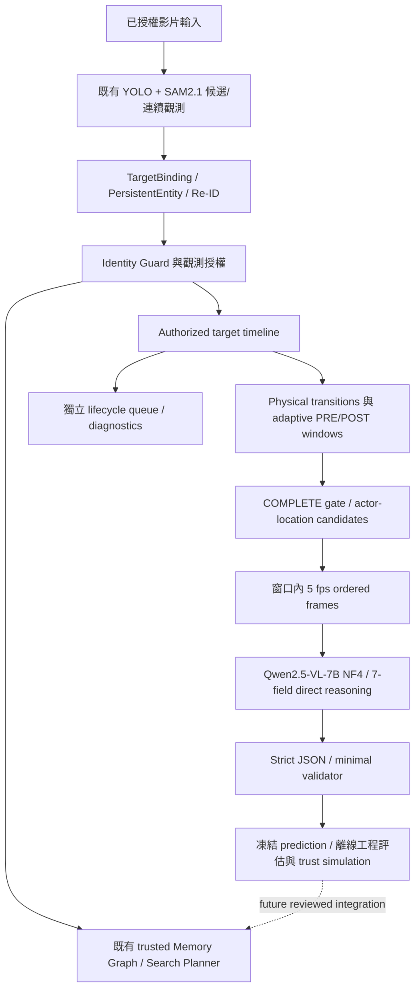

# FindMind — Current Pipeline Status

日期：2026-10-01。Repository consolidation、adaptive event windows、dense Qwen development inference 與報告完成。

## 決策摘要

**EVENT_WINDOW_BUILDER_PARTIAL_IMPROVEMENT**；**READY_TO_FREEZE_FOR_VALIDATION**。

已捕捉更多真正 pickup/放手/遮擋 evidence，但 Qwen9/9 STATIC，動作窗口 event 0/6、明確 release 0/3，safe searchable memory 0/9。這是可量測的 development 結果，不宣稱模型準確率已改善或可部署。

## 現在保留什麼


| 元件 | 保留理由 |
|---|---|
| `memory_graph.v293`、`outputs_v293` | Operational/reference；419 個 frozen artifacts 符合原 manifest。 |
| `v292` canonical identity + shared import closure | V293 實際依賴 102 個 modules；不能依版本名稱刪除。 |
| YOLO11s / SAM2.1 Hiera Small / MobileNetV3 | 原 identity/perception/Re-ID 仍需要。 |
| Qwen2.5-VL-7B-Instruct | 当前 direct-event reasoning checkpoint，NF4 4-bit。 |
| Qwen2.5-VL-3B-Instruct | V293 仍實際載入；不是無用重複 checkpoint。 |
| `outputs/reference_qwen` | 原 V2945 的 exact requests、responses、46 個 PNG、labels/runtime/reports/source snapshots；73 項 hash 可核對。 |
| `v21/v22/v23/v24/v25rerun/v26/v27/v28/v29/v291` 與需要的 outputs | 實際 runtime imports、protected fixtures、canonical lineage；不是保留全部歷史分支。 |
| raw development、manifested GT/data、未知使用者媒體 | 未刪；未知/validation 內容 opaque，不遍歷、不讀 metadata。 |
| `.venv`、project/lock/config/docs/git | 活躍依賴；修復 `.venv/pyvenv.cfg` 已不存在的 Python 路徑，不改模型/套件版本。 |


Current entrypoint：`scripts/run_current_pipeline.py`；source：`memory_graph.events.window_builder` + `memory_graph.reasoning`。V293 原 operational/reference 及 trusted identity/memory pipeline 保留；沒有硬把 102 個 shared modules搬成新 core/identity 架構。不存在新的版本號實驗堆疊。

## 架構與權限



虛線本次沒有實際更新。VLM 沒有 identity authority；window geometry 只產生窗口，不判定最終物理關係。


TargetBinding 建立目標、YOLO/SAM2候選/propagation、Re-ID similarity ≥ .60 且 best-second margin ≥ .10，再經 Identity Guard；候選/local IDs 不自動升為 PersistentEntity。授權 timeline 才能給 T marker。event/VLM 不可改身份、bank、guard、SAM reinit；下游 physical proposals 本次只 offline simulation。V293 原 promoted/identity-only/trust semantics 在 preserved source/hash/test 下有效。

## 模型及環境

Qwen/Qwen2.5-VL-7B-Instruct，revision `cc594898137f460bfe9f0759e9844b3ce807cfb5`；NF4 double quant / BF16，transformers4.57.6、torch2.10.0+cu128、CUDA12.8、RTX5070Ti16GB。相同 image preprocessing、800px thumbnail、greedy、max_new_tokens1400、120秒 timeout。

唯一 runtime correction：same SDPA 優先 CUDNN_ATTENTION，MATH fallback；解决 Windows dense math attention OOM，沒有降低 dense frames/尺寸/precision。修正前 abort4OOM+第五中斷；修正後 actual9/9EOS，inference133.36s，global peak11.01GiB。精確 config 在 `qwen/model_config.json`。`.venv` 的失效 Python home已修復；Windows 使用 `-X utf8 -B`，避免中文工程報告被 cp950 stdout 阻擋。

## Event Window Builder 完成度

已實作 trusted seconds-based timeline、motion/visibility/actor-association triggers、adaptive PRE .7s / POST1s、2–6s bounds、complete gate、獨立4 physical/6 lifecycle budgets、2 actor/3 location roles、5fps ordered frames與frozen manifests。沒有 window tuning（corrections0）。

| 影片 | 物理 selected | COMPLETE | INCOMPLETE | 實際 Qwen calls |
|---|---:|---:|---:|---:|
| test1 | 3 | 2 | 1 | 2 |
| test2 | 2 | 1 | 1 | 1 |
| test3 | 3 | 1 | 2 | 1 |
| test4 | 2 | 0 | 2 | 0 |
| test5 | 2 | 2 | 0 | 2 |
| test6 | 0 | 0 | 0 | 0 |
| test7 | 1 | 1 | 0 | 1 |
| test8 | 3 | 2 | 1 | 2 |
| test9 | 1 | 0 | 1 | 0 |


已處理 frozen manifested test1–test9（9部）上下游歷史授權資料；本次 fresh adaptive frame decode + Qwen inference，**沒有把 YOLO/SAM/Re-ID 全部重新跑**。test6無physicaltrigger、test9只有incomplete，皆有 timeline/diagnostics。Raw media hashes/timebase記於 `event_windows/development_inputs.json`，與 V292 manifests 核對。

## Development 結果

17 physical selected、9complete/8incomplete、52獨立lifecycle；自動complete52.9%。工程review視覺complete8/17（dispatch6/9），eligible14/17（dispatch8/9），placement/放低/release可檢查10/17，確認release3packs/2episodes。Old eligible5/9 → new8/9，但跨事件/scene分布改變，非pairedaccuracy。

| 欄位 | 舊窗口・ALL | 新窗口・ALL | 舊 eligible | 新 eligible |
|---|---:|---:|---:|---:|
| 事件類型 | 2/7 (28.6%) | 3/9 (33.3%) | 0/5 (0.0%) | 2/8 (25.0%) |
| 互動 actor | 1/9 (11.1%) | 3/9 (33.3%) | 1/5 (20.0%) | 2/8 (25.0%) |
| 是否放手 | 6/9 (66.7%) | 3/9 (33.3%) | 4/5 (80.0%) | 2/8 (25.0%) |
| 最末可見性 | 3/9 (33.3%) | 7/9 (77.8%) | 1/5 (20.0%) | 7/8 (87.5%) |
| 最末關係 | 7/9 (77.8%) | 5/8 (62.5%) | 3/5 (60.0%) | 4/7 (57.1%) |
| 最末 location/關係對象 | 5/9 (55.6%) | 6/9 (66.7%) | 1/5 (20.0%) | 5/8 (62.5%) |


Actual9EOS、9schema、8validator；unsafephysical3/9同舊3/9；safe searchable memory0、P/C/U/R=0/0/4/5。完整動作6packs全部STATIC錯，confirmed release3packs全答NO。原 frozen baseline沒有覆寫；fresh same-runtime old9calls另保存。

## Repository 清理

已刪已知 123,561 files / 12,432 directories，reclaimed 65,695,686,243 bytes = 61.184GiB（下限）。Molmoweights/code/tests/remote-code/deps/outputs全部移除；unusedSAM3/SAM3.1權重與環境、obsoleteVLMbranches/14testmodules/大型歷史outputs/caches移除。原Qwen exact baseline consolidation後原V2945versionfolder刪除。完整清單及理由見 `cleanup/CLEANUP_REPORT.md`，歷史摘要見 `ARCHIVED_EXPERIMENT_HISTORY.md`。

## 測試與安全

28active testmodules；focused116pass、full346pass、0fail/skip。原3historical hash failures是obsoletefixture scope刪除，不是修好。V293419frozenfiles通過、canonical identity/memory hashes不變；test2 fusion、test7 safety、test8f804/forward recovery、test9unresolved保留。unauthorizedMATCHED0、VLMidentitywrites0、actualphysicalwrites0。沒有改相鄰mixure_test，也沒有讀取新validation內容。

## 尚未完成與問題優先序

| 優先 | 問題 | 證據/後續量測需求 |
|---|---|---|
| P0 | Qwen event/actor/release理解 | complete action0/6、release0/3；需凍結證據測一般化，不能再以增加影格當已解決。 |
| P1 | 正確独立location context | phone self-alias、箱誤分類laptop、正確destination沒marker；需 generic context contract/來源改善。 |
| P1 | motion/complete gate | camera falsephysical3/9；test3兩個視覺complete被拒；需独立標註與camera/stability診斷。 |
| P2 | episode dedup/phase | test1重複窗及test3/4重疊；當前計pack、不可假設獨立sample。 |
| P2 | 評估可信度 | review是執行代理、非blind獨立human GT；無全片physicalGT，未知 recall。 |
| P2 | operational memory integration | 本次僅離線，沒有將Qwencandidate接進trustedgraph；safe0所以不能啟用無保護寫入。 |
| P3 | 維護與性能 | sharedlegacyimports仍必要；.venv依本機bundledPython；load/kernelwarmup和完整perception端到端成本未量測。 |

## 如何使用已凍結結果

```powershell
# 工作目錄必須為 mixure_test_SAM
.venv/Scripts/python.exe -X utf8 -B scripts/run_current_pipeline.py verify
.venv/Scripts/python.exe -X utf8 -B scripts/run_current_pipeline.py verify-reference
.venv/Scripts/python.exe -X utf8 -B scripts/run_v293.py verify
.venv/Scripts/python.exe -X utf8 -B scripts/run_development_eval.py
```

`prepare/run` 受 frozen artifact guard限制，不能覆寫已凍結 results。上述eval只重建review衍生統計，不改prediction；正式交付後如要維持finalintegritymanifest，應先核對已存JSON，不任意覆寫衍生files。未新增接受任意validationmedia的入口，本次handoff是凍結規格而非已執行的validation。

## 報告索引

- `cleanup/CLEANUP_REPORT.md`：A–G完整清理與保留理由。
- `EVENT_WINDOW_BUILDER_REPORT.md`：16節、17窗逐事件失敗歸因。
- `evaluation/baseline_comparison.json`：original/同runtimeold/new/matchedscene。
- `evaluation/window_quality.json`、`coverage_details.json`、`reasoning_metrics.json`、`search_memory.json`。
- `regression/test_results.json`、`identity_safety.json`。
- `final/artifact_manifest.json`、`baseline_prediction_manifest.json`、`final_integrity_manifest.json`。
- `VALIDATION_HANDOFF.md`：模型、prompt、全域params、選窗/roles/validator/metrics凍結。

## Validation readiness

READY_TO_FREEZE_FOR_VALIDATION：architecture與identity safety可重現，denseAPI/runtime已有真實測量，沒有阻止量測的已知contract/runtime defect。既有context與模型推理缺陷是要量測的limitations；READY不代表準確或production-ready。下一步held-out應一次使用相同frozen配置，預先定denominator、保留unsafe/write門檻；本次停止於development報告。
