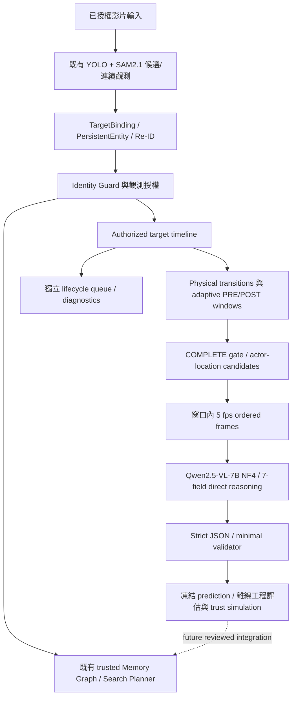

# FindMind — Event Window Builder Report

日期：2026-10-01。決策：**EVENT_WINDOW_BUILDER_PARTIAL_IMPROVEMENT**。密集影格已成功實測；證據捕捉改善，安全搜尋記憶沒有增加。

## 1. Why old windows were insufficient

清理前驗證 latest executable clean path 為 V2945 Qwen direct-event，而非失敗 Molmo/V2946。9 個 old packs、6 個 logical events，取自 test1/test2/test8；46 張 ordered sparse composites。原工程 review 5/9 eligible 是持握判讀可量測，沒有完整 pickup/placement/release 轉折，不等於 transition complete。舊模型 6 STATIC/3 PLACED、9 NONE relations，safe memory 0。

## 2. New builder design

deterministic target-centric timeline → state transition trigger → backward stable PRE / forward stable POST → seconds-based bounds → completeness/chain gate → independent physical/lifecycle budget → actor/location roles → dense window-only evidence。

虛線本次沒有實際更新。VLM 沒有 identity authority；window geometry 只產生窗口，不判定最終物理關係。

## 3. State timeline

合併既有 V292 canonical sampled metadata、trusted memory observations/masks 與已授權 V293 dense rows。VISIBLE/MATCHED 必須具 trusted observation 或既有 geometry authorization；candidate 外觀本身不成 phone_01。保存 frame/time/FPS、authorized bbox/mask/provenance、chain_id、observed/partial/untrusted/unobserved、motion speed/state、existing actor associations。PARTIAL 為 bbox 邊界 proxy，非新 learned visibility model。

幾何使用 normalized image-diagonal speed，若至少兩個同 track location contexts 連續存在，減去其 median translation 以粗略補攝影機移動。這不是完整 camera motion compensation，因此仍會產生 false physical triggers。沒有新 YOLO/SAM 推論，也沒有用 GT 或 VLM 建 window。

## 4. Transition triggers

STATIONARY_TO_MOVING、MOVING_TO_STATIONARY、MOVEMENT_TO_UNOBSERVED 等 physical patterns；appearance/recovery/gap/continuity 類另入 lifecycle。任何 trigger 都不是 PICKED_UP/PLACED 的 truth label。持握 hand/person source 只用原 detector observations，沒有新增手部 detector。

## 5. Adaptive start/end logic

| 全域參數 | 值 |
|---|---:|
| `stable_pre_seconds` | 0.7 |
| `stable_post_seconds` | 1.0 |
| `min_seconds` | 2.0 |
| `preferred_seconds` | 3.5 |
| `max_seconds` | 6.0 |
| `max_observation_gap_seconds` | 0.4 |
| `motion_speed_image_diagonals_per_second` | 0.04 |
| `velocity_interval_seconds` | 0.2 |
| `smoothing_seconds` | 0.4 |
| `state_dwell_seconds` | 0.3 |
| `dense_frame_fps` | 5.0 |
| `physical_budget_per_video` | 4 |
| `lifecycle_budget_per_video` | 6 |
| `max_actor_candidates` | 2 |
| `max_location_candidates` | 3 |

同一組全域參數適用 test1–test9。後向找稳定 PRE；前向找稳定 POST，延續到 post dwell，考慮 observation gap、chain continuity、scene/timebase 和界限。最大 6 秒，找不到即 INCOMPLETE；不依影片調整。窗口參數修正次數 **0**。實際 COMPLETE 時長 2.4–4.8 秒。

## 6. Completeness gate

只有 HAS_PRE_STATE + HAS_TRANSITION + HAS_POST_STATE，且 duration/authorization/chain 条件通過才是 COMPLETE。8 個 INCOMPLETE 沒有送 physical Qwen。自動 complete 與視覺 complete 分別報告，不能把存在 state trigger 當實際語意轉折。工程檢查 9 個 dispatched 有 6 個視覺完整動作窗口；其餘 test2 W01/test5 W01/test8 W07 主要是 stationary/camera triggers。test3 W02/W03 雖可視覺看到轉折，卻因授權/PRE 穩定 gate 拒絕，屬 false-negative coverage。

## 7. Lifecycle vs physical events

每影片 physical budget 4、lifecycle budget 6，獨立選取；本次 17 physical + 52 lifecycle。test6 沒有合格 physical trigger，沒有硬塞窗口；test9 僅 incomplete，仍 unresolved。Lifecycle 未耗用 physical budget，不送此次 physical reasoning。

## 8. Actor vs location context

原 person/hand/arm/carrier 類為 actor，其他 detector-supported objects 為 location candidate；最多 2 actor + 3 location。15/17 窗口供有 actor、16/17 供有 location，**不代表供有正確目的地**。無 actor 可答 NONE。保持原七欄命名 `interaction_anchor`，prompt 只追加 roles。test5 box 被原偵測叫 laptop、test8 T 別名混入 location、test8 W04 椅子被叫 person 皆為已凍結 context 限制，review 不改輸入。

## 9. Temporal representation

**DENSE_ORDERED_EVENT_FRAMES**：現有 image backend 已可運行，沒有另加 video architecture。每窗口取接近 5 fps 的順序 frame，保留界限/trigger；9 次共 **168 张 800×600 composites**，每次 13–22 張。所有 frame 都在 adaptive boundaries 內，T 只標授權 frame，未插值 target，未靠將來影格補身份。圖上的 BEFORE/DURING/AFTER 是 trigger-relative phase，不是 action GT。

初次 dense run 的 Windows SDPA math fallback 在約 12k tokens 配出 15.17 GiB attention matrix，4 個已完成 OOM、第五個中斷；保留 `qwen/runtime_compatibility_initial`。唯一通用 runtime 修正是在同 SDPA 中優先 cuDNN、math fallback；checkpoint/quantization/image dimensions/prompt/request/frame/builder parameters 全不變。三種 causal GQA、vision noncausal、cached decode synthetic checks 通過。修正後 9/9 EOS、0 OOM/timeout，再把舊 9 packs 用相同 runtime 全重跑。這是 runtime correction 1，不是 window tuning。

## 10. Window-quality results

| 影片 | 物理 selected | COMPLETE | INCOMPLETE | 實際 Qwen calls |
|---|---:|---:|---:|---:|
| test1 | 3 | 2 | 1 | 2 |
| test2 | 2 | 1 | 1 | 1 |
| test3 | 3 | 1 | 2 | 1 |
| test4 | 2 | 0 | 2 | 0 |
| test5 | 2 | 2 | 0 | 2 |
| test6 | 0 | 0 | 0 | 0 |
| test7 | 1 | 1 | 0 | 1 |
| test8 | 3 | 2 | 1 | 2 |
| test9 | 1 | 0 | 1 | 0 |

| 指標 | 結果 |
|---|---:|
| 選取物理窗口 | 17 |
| 自動 COMPLETE / INCOMPLETE | 9 / 8 |
| 自動 complete rate | 52.9% |
| 視覺完整 PRE→transition→POST（所有 selected） | 8/17 |
| 視覺完整（已 dispatch） | 6/9 |
| 個別 direct reasoning eligible（selected） | 14/17 |
| reasoning eligible（已 dispatch） | 8/9 = 88.9% |
| 可檢查 placement/release/放低轉折 | 10/17；其中 5 個送 Qwen |
| 明確可見放手 | 3 packs，2 次實際 episode（test1/test8） |

「可檢查」包括箱口放低/遮擋，不宣稱都真的放手。10 packs 合併重疊窗口為 6 個可檢查 episode；有兩次確認 release。沒有全片獨立 GT action census，因此**不能報全影片 placement recall**。視覺 labels 為執行代理的 post-freeze 工程 review，非獨立人類標註或完整模型 accuracy。

| pack | 時間 (秒) | 自動 gate | 視覺完整 | eligible | 放低/release 可檢查 | 明確 release |
|---|---|---|---|---|---|---|
| test1__W01 | 3.80–5.40 | I | False | True | False | False |
| test1__W03 | 5.20–8.80 | C | True | True | True | True |
| test1__W05 | 5.20–8.80 | C | True | True | True | True |
| test2__W01 | 6.00–9.60 | C | False | True | False | False |
| test2__W08 | 17.77–21.01 | I | False | True | True | False |
| test3__W02 | 11.60–16.80 | I | True | True | True | False |
| test3__W03 | 13.20–16.80 | I | True | True | True | False |
| test3__W07 | 13.40–17.00 | C | True | True | True | False |
| test4__W06 | 13.60–16.60 | I | False | True | True | False |
| test4__W08 | 14.80–16.60 | I | False | True | True | False |
| test5__W01 | 5.40–7.80 | C | False | True | False | False |
| test5__W05 | 11.40–15.00 | C | True | True | True | False |
| test7__W05 | 12.40–16.00 | C | True | True | False | False |
| test8__W04 | 14.40–15.60 | I | False | False | False | False |
| test8__W06 | 28.57–32.07 | C | True | True | True | True |
| test8__W07 | 31.20–35.14 | C | False | False | False | False |
| test9__W03 | 18.40–19.60 | I | False | False | False | False |

## 11. Qwen results

9/9 schema、8/9 minimal validator；1 個 STATIC_RELEASE 被拒。全部 9 個 event_type 都 STATIC；relation ON 2 / NONE 6 / INSIDE 1。6 個視覺完整且已 dispatch 的動作窗口，event type **0/6**；3 個確認 release packs，release YES **0/3**。整体 3/9 event 正確主要來自原本靜置/camera窗口，不能宣稱 physical action 已改善。

| 欄位 | 舊窗口・ALL | 新窗口・ALL | 舊 eligible | 新 eligible |
|---|---:|---:|---:|---:|
| 事件類型 | 2/7 (28.6%) | 3/9 (33.3%) | 0/5 (0.0%) | 2/8 (25.0%) |
| 互動 actor | 1/9 (11.1%) | 3/9 (33.3%) | 1/5 (20.0%) | 2/8 (25.0%) |
| 是否放手 | 6/9 (66.7%) | 3/9 (33.3%) | 4/5 (80.0%) | 2/8 (25.0%) |
| 最末可見性 | 3/9 (33.3%) | 7/9 (77.8%) | 1/5 (20.0%) | 7/8 (87.5%) |
| 最末關係 | 7/9 (77.8%) | 5/8 (62.5%) | 3/5 (60.0%) | 4/7 (57.1%) |
| 最末 location/關係對象 | 5/9 (55.6%) | 6/9 (66.7%) | 1/5 (20.0%) | 5/8 (62.5%) |

新 final relation 有 1 個 containment truth 不可決，故 denominator 8；其餘欄位依 review admissible values 評分，UNCERTAIN 表示供圖不能證明 release。invalid answer 沒有從內容 denominator 排除。

load 42.20 秒；9 次 inference 133.36 秒；peak **global GPU used** 11.01 GiB。這是 monitor 的全 GPU 使用量峰值，非僅此 process 的 tensor allocation。無答案重試；初次 aborted runtime 另列，未混入 canonical 9 calls。

## 12. Baseline vs new-window comparison

原 V2945 frozen benchmark unchanged，另用新 cuDNN SDPA 在 exact old prompt/images 重跑 9 次：9 EOS/9 schema/7 validator、86.47 秒。3 個答案的 visibility/confidence 有差異；event/actor/release/relation fields 不變。舊 fresh eligible 5/9，新 8/9；明確 transition capture 0 old → 8 selected / 6 dispatched new；old confirmed release 0 → new 3 packs/2 episodes。

表中 primary comparison 用 **fresh same-runtime baseline**。同 checkpoint/revision/NF4/BF16/preprocessing/generation/kernel；minimal actor/location prompt adaptation 是已知 confound。Old 只 test1/test2/test8、新 builder 包含 9 個 manifested scenes，只有 6 個影片有 COMPLETE dispatch；boundary/contexts/class proportions 改變且 packs 相關。另存同 scene subset 5 new packs，但不是相同事件 paired accuracy。不能從小樣本數據宣稱純因果模型 accuracy 提升。

release 6/9 → 3/9、relation 7/9 → 5/8 變差；visibility 3/9 → 7/9 改善；actor 1/9 → 3/9、location 5/9 → 6/9，但新動作窗口仍沒判對 actor/action。Unsafe 3/9 → 3/9，safe memory 0 → 0。因此只判 **PARTIAL_IMPROVEMENT（evidence quality）**。

## 13. Safe searchable memory

沿用保守 V2945 offline mapping，不改 operational Memory Graph trust policy。SUPPORTED real relation 仍需 material assertions safe；weak relation 還需 search usefulness；invalid/unsafe/wrong relation 拒絕。結果 P=0/C=0/U=4/R=5，**safe searchable memory 0/9**，actual identity/physical writes、Memory Graph/Search Planner updates 全為 0。NONE abstention 有價值但不會產生位置記憶；test1 W03 ON B 雖對，其他核心事件/放手欄位錯，未 promotion。

## 14. Failure cases

### test1__W01

開頭已在 A 手中，持握與攝影機移動可見，但沒有未持握 PRE 或完整拿起/放下；未送 Qwen。

Failure：`NO_STABLE_PRE_STATE`, `WINDOW_END_TOO_EARLY`, `TRANSITION_NOT_CAPTURED`。

### test1__W03

5.2–8.8 秒：手 A 持手機、f186–192 放手、手機留在桌面；有完整持握→release→靜置。B 在後段為桌面。兩個窗口邊界/影格相同，屬同一次 release；W03 ON B 合理但 STATIC/NONE actor/NO release 錯，W05 又漏掉 ON B。

Failure：`QWEN_EVENT_REASONING_ERROR`, `QWEN_ACTOR_ERROR`。

### test1__W05

5.2–8.8 秒：手 A 持手機、f186–192 放手、手機留在桌面；有完整持握→release→靜置。B 在後段為桌面。兩個窗口邊界/影格相同，屬同一次 release；W03 ON B 合理但 STATIC/NONE actor/NO release 錯，W05 又漏掉 ON B。

Failure：`QWEN_EVENT_REASONING_ERROR`, `QWEN_ACTOR_ERROR`, `QWEN_RELATION_ERROR`。

### test2__W01

6.0–9.6 秒手機已在桌上，只有攝影機/框抖動，未捕捉 placement；STATIC 可量測且正確，NONE 漏掉供有 B 桌面的 ON。自動 COMPLETE 不等於真正物理轉折。

Failure：`WINDOW_START_TOO_LATE`, `TRANSITION_NOT_CAPTURED`, `EVENT_SELECTION_WRONG`, `QWEN_RELATION_ERROR`。

### test2__W08

開頭已持握，手機移到微波爐上熊後，手後段改碰熊。遮擋/放低過程可供檢查，但確切 release 與末端關係不足，不把 behind/inside 設成確定 truth；未送 Qwen。

Failure：`NO_STABLE_PRE_STATE`, `WINDOW_START_TOO_LATE`, `UPSTREAM_IDENTITY_LIMITATION`。

### test3__W02

手機在桌面，約 14.6 秒手拿起，再向開口箱放低並被箱/手遮住。完整 pickup→移動→不可見可辨，release 本身未看清。箱不是供有 marker 的 location，不能強迫 INSIDE 某個球/椅子/微波爐。W02/W03 視覺有轉折卻因授權/穩定 PRE gate 未通過；W07 推論 STATIC/NONE actor 錯。三者重疊同一次事件。

Failure：`NO_STABLE_PRE_STATE`, `LOCATION_CONTEXT_MISSING`, `UPSTREAM_IDENTITY_LIMITATION`。

### test3__W03

手機在桌面，約 14.6 秒手拿起，再向開口箱放低並被箱/手遮住。完整 pickup→移動→不可見可辨，release 本身未看清。箱不是供有 marker 的 location，不能強迫 INSIDE 某個球/椅子/微波爐。W02/W03 視覺有轉折卻因授權/穩定 PRE gate 未通過；W07 推論 STATIC/NONE actor 錯。三者重疊同一次事件。

Failure：`NO_STABLE_PRE_STATE`, `LOCATION_CONTEXT_MISSING`, `UPSTREAM_IDENTITY_LIMITATION`。

### test3__W07

手機在桌面，約 14.6 秒手拿起，再向開口箱放低並被箱/手遮住。完整 pickup→移動→不可見可辨，release 本身未看清。箱不是供有 marker 的 location，不能強迫 INSIDE 某個球/椅子/微波爐。W02/W03 視覺有轉折卻因授權/穩定 PRE gate 未通過；W07 推論 STATIC/NONE actor 錯。三者重疊同一次事件。

Failure：`LOCATION_CONTEXT_MISSING`, `UPSTREAM_IDENTITY_LIMITATION`, `QWEN_EVENT_REASONING_ERROR`, `QWEN_ACTOR_ERROR`。

### test4__W06

開頭手機已垂直握在手中，移向箱口後被箱壁/手擋住；可檢查放低與遮擋，缺 pickup 前 PRE，未能確認放手。箱沒有可靠 location marker；W08 僅 1.8 秒，未送 Qwen。

Failure：`NO_STABLE_PRE_STATE`, `WINDOW_START_TOO_LATE`, `UPSTREAM_IDENTITY_LIMITATION`, `LOCATION_CONTEXT_MISSING`。

### test4__W08

開頭手機已垂直握在手中，移向箱口後被箱壁/手擋住；可檢查放低與遮擋，缺 pickup 前 PRE，未能確認放手。箱沒有可靠 location marker；W08 僅 1.8 秒，未送 Qwen。

Failure：`NO_STABLE_PRE_STATE`, `WINDOW_START_TOO_LATE`, `UPSTREAM_IDENTITY_LIMITATION`, `LOCATION_CONTEXT_MISSING`。

### test5__W01

5.4–7.8 秒手机一直在桌面，攝影機改變而授權 T 中段消失；手機仍可見，不是拿起/放下。供有球/箱(原偵測標籤 laptop)/椅子，無有效桌面 marker，NONE 合理。六個可評欄位正確，但 NONE 不建立位置記憶。

Failure：`EVENT_SELECTION_WRONG`, `TRANSITION_NOT_CAPTURED`, `UPSTREAM_IDENTITY_LIMITATION`。

### test5__W05

11.4–15.0 秒由桌面拿起手機，再往箱口放低；後段手机被遮住。E raw label laptop 實際框到箱區，INSIDE E 方向有弱證據，但末端 containment/release 未完整確認，因此 relation truth 不可決、HIGH INSIDE 為過強物理宣稱。STATIC、E 當 actor 與 visible YES 都錯；不能安全寫入。

Failure：`QWEN_EVENT_REASONING_ERROR`, `QWEN_ACTOR_ERROR`, `QWEN_RELATION_ERROR`, `LOCATION_CONTEXT_MISSING`, `UPSTREAM_IDENTITY_LIMITATION`。

### test7__W05

12.4–16.0 秒手 A 將桌面手機抬成垂直後拿走，後段出畫面。沒有可見 release；STATIC+released YES 錯，validator 已以 STATIC_RELEASE 拒絕，NONE final relation/visible NO 合理。

Failure：`QWEN_EVENT_REASONING_ERROR`, `QWEN_ACTOR_ERROR`, `UPSTREAM_IDENTITY_LIMITATION`。

### test8__W04

14.4–15.6 秒只有開頭桌面手機與手，攝影機立即移開，目標授權/可見資訊不足。後段 A 是椅子誤分類 person，不能当 actor，也不能推定拿走或 release；未送 Qwen。

Failure：`NO_STABLE_PRE_STATE`, `WINDOW_END_TOO_EARLY`, `TARGET_NOT_VISIBLE_ENOUGH`, `EVENT_SELECTION_WRONG`, `UPSTREAM_IDENTITY_LIMITATION`。

### test8__W06

28.57–32.07 秒手 A 持手機，約 f906–918 放到黄色電話底座後離手，有可見 release。B/C cell-phone 框與 T 自身重疊/別名，D 是其他電話；沒有獨立底座 location marker。ON B 不是合法獨立目的地關係，STATIC/NO release/NONE actor 也錯；禁止自關係與混淆手機導致寫入。

Failure：`LOCATION_CONTEXT_MISSING`, `QWEN_EVENT_REASONING_ERROR`, `QWEN_ACTOR_ERROR`, `QWEN_RELATION_ERROR`, `UPSTREAM_IDENTITY_LIMITATION`。

### test8__W07

31.2–35.14 秒手機已放好，攝影機轉開使目標出畫面；後段其他人/裝置沒有 T 授權，不替換為 phone_01。STATIC/NONE/NO release 可評，但末端 visible YES 錯，整體不納 reasoning-eligible。僅錯誤可見性未計入沿用的 unsafe placement/release/relation 定義。

Failure：`EVENT_SELECTION_WRONG`, `TRANSITION_NOT_CAPTURED`, `TARGET_NOT_VISIBLE_ENOUGH`, `UPSTREAM_IDENTITY_LIMITATION`。

### test9__W03

18.4–19.6 秒只有起始 T 授權，後續手與手機外觀可見但身份未確認。不能從外觀/將來影格補授權，無可信連續 PRE/POST，test9 仍 unresolved；未送 Qwen。

Failure：`NO_STABLE_PRE_STATE`, `WINDOW_END_TOO_EARLY`, `TARGET_NOT_VISIBLE_ENOUGH`, `UPSTREAM_IDENTITY_LIMITATION`。

test1 W03/W05 是相同 underlying frames/boundaries，不同 trigger-phase，算相關 packs；test3 和 test4 也有重疊。同事件去重尚待後續，不把它們算独立成功。`evaluation/failure_analysis.json` 使用指定 taxonomy，review 後沒有調模型/窗口。

## 15. Remaining bottleneck

**Qwen7B 對標記區域的時序動作理解**：即使 release/pickup 全程存在，仍全判 STATIC、動作 actor 全判錯，無法產生安全記憶。先凍結這次 evidence 與結果；後續問題按優先序：①動作/actor/release推理；②location 的 self-alias、錯誤 detector class、實際目的地缺失；③camera compensation與完整gate false positive/negative；④重疊事件去重、trigger phase bias；⑤獨立 GT/人類 review 與 unique-episode metrics；⑥解耦舊 shared lineage 路徑；⑦安全規則下的 operational memory integration/端到端延遲。此次沒有調上述參數、改模型或做新 validation。

## 16. Validation readiness

**READY_TO_FREEZE_FOR_VALIDATION**：repo dependency consolidation 完成、current executable、dense runtime defect 已修正、原始預測與 architecture frozen、Identity Guard 安全無變。READY 指可做預先凍結的 held-out 量測，**不是 production-ready 或 physical reasoning 成功**。下一個科學上有用步驟是同設定 held-out 評估，不再依 development 單片調 window。詳細冻结條件見 `VALIDATION_HANDOFF.md`；本次未讀/跑新 validation。
